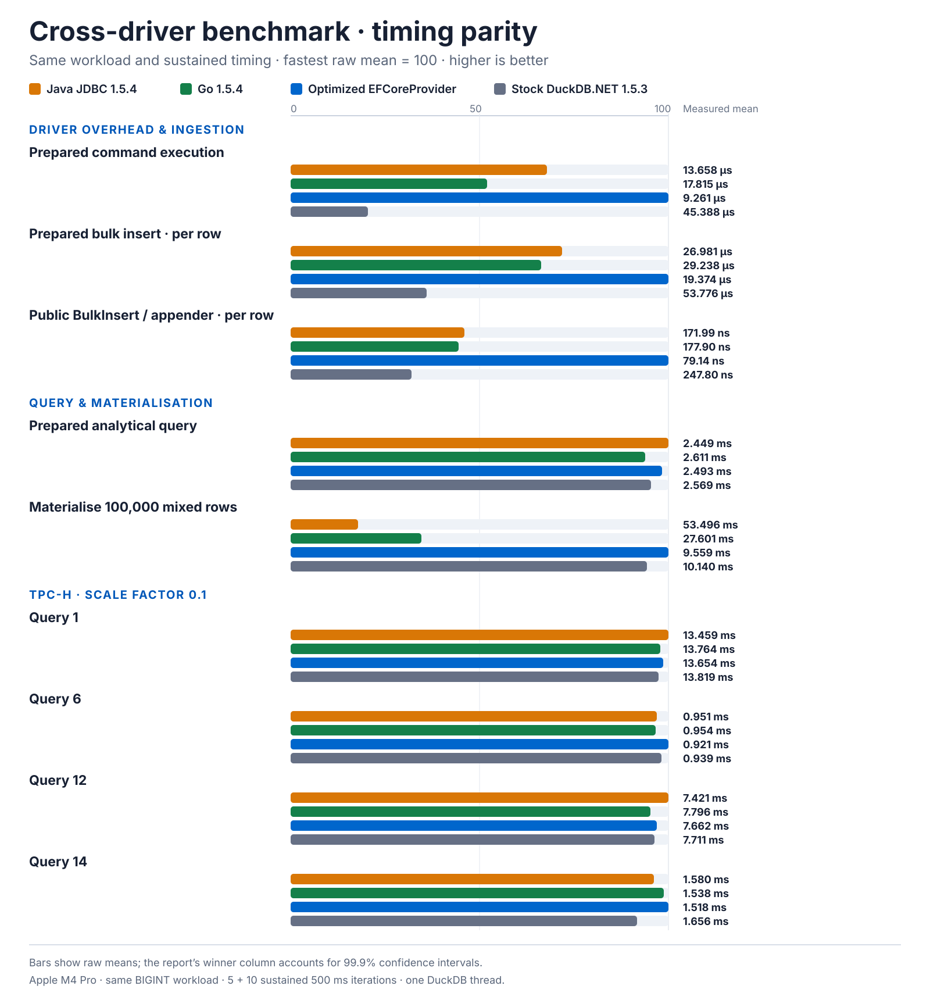

# Changelog

All notable changes to `DuckDB.EFCoreProvider` are documented here. The package follows [semantic versioning](VERSIONING.md); the same notes ship in the NuGet package's release notes.

## 1.23.0

- Inline supported EF Core `ValueConverter` expressions into the shared compiled Appender writer used by
  `BulkInsert` and staged `Upsert`, eliminating per-row boxing allocations while retaining the safe fallback for
  field-only and unsupported provider shapes. Compiled reads honor EF's configured property-access member, including
  mapped backing fields.
- Add an explicit `DuckDBUpsertInputMode.DistinctConflictTargets` contract. Callers that guarantee conflict-target
  uniqueness across the complete input can bypass the staging window; deterministic last-input-wins behavior remains
  the default. The option-first overloads preserve source compatibility with existing batch-size calls.
- Replace the correlated logical-key cardinality check with an atomic set-based semi-join guard inside the same
  `MERGE`, retaining fail-before-mutation behavior for DuckLake and native logical-key merges.
- Avoid defensive array-parameter copies for DuckDB.NET-proven `T[]`, `List<T>`, `ReadOnlyCollection<T>`, and
  `ImmutableArray<T>` values. Other enumerable and custom `IReadOnlyList<T>` implementations retain the safe
  `List<T>` conversion.

Before and after were measured on the same Apple Silicon machine and process environment with BenchmarkDotNet
0.15.8, .NET 10.0.11, and native DuckDB. Lower is better; the distinct-input rows measure the final conflict
statement, and the logical-key rows use 10,000 incoming keys.

| Workload | Before | After | Winner |
|---|---:|---:|---|
| Three value-type converters | 144 B/row allocated | 0 B/row allocated | After; allocation eliminated |
| Distinct Upsert, 10,000 staged rows | Window: 3.160 ms; 880 B | Direct source: 2.266 ms; 1,552 B | After; 28.3% lower latency |
| Distinct Upsert, 50,000 staged rows | Window: 9.811 ms; 4,528 B | Direct source: 6.859 ms; 4,528 B | After; 30.1% lower latency |
| Logical-key guard, 100,000-row target | Correlated: 6.897 ms | Atomic semi-join: 4.027 ms | After; 41.6% lower latency |
| Logical-key guard, 500,000-row target | Correlated: 20.247 ms | Atomic semi-join: 3.302 ms | After; 83.7% lower latency |
| 500-element read-only-list parameter | Copy: 431.8 us; 42.54 KB | Direct: 402.9 us; 40.54 KB | After; 2.00 KB less allocation; latency unproven |

See [docs/PERFORMANCE-REVIEW-FOLLOW-UPS.md](docs/PERFORMANCE-REVIEW-FOLLOW-UPS.md) for methodology, confidence
limits, rejected proposals, and reproduction commands.

## 1.22.0

- Add `UseEncryptedDuckDB(path, keyProvider)` and `UseDuckDB(o => o.UseEncryptedDatabase(path, keyProvider))`:
  store a context's data in a DuckDB file encrypted with AES-256-GCM. DuckDB accepts an encryption key only as an
  `ATTACH` parameter, so the provider hosts the encrypted file on a shared in-memory database, attaches it with the
  application-supplied key, and selects it as the default catalog; entities, migrations, and the migrations history
  and lock tables are created inside the encrypted file. The key provider is invoked once per attachment, and the
  `ATTACH` statement runs outside EF Core's command pipeline, so keys reach neither the options nor EF logs,
  diagnostics, or interceptors. `EnsureCreated`, `EnsureDeleted` (which detaches before deleting the file and any
  leftover WAL), and existence checks are catalog-aware. Configuration covers the catalog alias, a read-only
  attachment, and DuckDB's `temp_file_encryption`, which the provider enables by default because a spilling query
  over an encrypted database otherwise writes row data to the temporary directory in the clear. See
  [docs/ENCRYPTION.md](docs/ENCRYPTION.md).
  Attachment is idempotent, so contexts that open concurrently share one attachment rather than racing, and the
  provider confirms the attached database is the configured file — resolving symbolic links in every path
  segment, including a symlinked database file — and that a joining context's key matches the attaching key
  (verified against an in-memory SHA-256 fingerprint, so a wrong or rotated-away key cannot inherit another
  context's access). `EnsureDeleted` detaches through the provider connection so a context holding an open
  connection re-attaches on the next use instead of silently writing to the in-memory host, and tiered-storage
  operations attach the encrypted catalog even when the application opened the raw connection itself. A
  connection string applied after `UseEncryptedDatabase` must keep the shared in-memory host; a plain
  `:memory:` source is rejected because it would give each connection its own instance and an independent
  writable attachment of the same file. `CreateReadOnlyConnection()` is refused for an
  encrypted database because its access mode belongs to the attachment that every context on the host instance
  shares; configure a read-only context with `ReadOnly()` instead.
- Add `DuckDBEventId.EncryptedDatabaseAttachmentStarting`, `…Completed`, and `…Failed` for attachment diagnostics.
- Scope the migrations-history existence probe to the current catalog. `duckdb_tables()` spans every attached
  database, so a host instance holding another context's history table under the same name could otherwise be
  mistaken for this context's own.
- Resolve symbolic links when comparing an attached database's path with the configured one, so a catalog reached
  through a linked directory (macOS temporary directories under `/var`) is recognized as already attached instead
  of reported as a different database.

## 1.21.0

- Add an opt-in `DuckDBUpsertMatchMode.LogicalKeyMerge` for the conflict-target `UpsertAsync` overload. It merges
  on the selected properties as a logical key through a set-based `MERGE INTO` without requiring — or maintaining —
  a physical unique constraint, avoiding the ART-index write cost and memory footprint that grow with target table
  size under sustained ingest. A staged batch fails before mutation when one staged key matches multiple existing
  rows; targets backed by a physical unique constraint skip that per-batch validation. The pre-mutation cardinality
  error message is now engine-neutral because it applies beyond DuckLake.
- Add `UseDuckDB(o => o.CheckpointThreshold("1GB"))`: configures DuckDB's `checkpoint_threshold` when a connection
  opens. DuckDB's default 16 MB WAL threshold makes automatic checkpoints — which re-serialize in-memory ART
  indexes — dominate sustained indexed ingest; raising it and issuing explicit `CHECKPOINT` statements at ingest
  boundaries removes that growth term. In a controlled 3M-row random-GUID reproduction, per-batch growth fell from
  +178% to +32% with a raised threshold, and an index-free `LogicalKeyMerge` lane measured ~5x faster still.

## 1.20.1

- Resolve duplicate conflict-target values within one `Upsert` input to the last occurrence in input order. The
  v1.19.1 width-aware chunks silently applied the first staged duplicate, whereas v1.19.0's 500-row chunks applied
  the last occurrence whenever duplicates crossed a chunk boundary. Staged chunks now deduplicate per conflict key
  before the conflict statement runs, so the outcome is deterministic for any duplicate spacing and matches what
  sequential per-row upserts would produce. Key-only `DO NOTHING` shapes still keep the first inserted row per key.
- The staged deduplication window adds no measurable latency: the deterministic one-million-row mixed
  update/insert benchmark measured 600.5 ± 13.8 ms and 565.08 KB allocated versus 627.7 ± 10.1 ms and 503.08 KB
  for v1.20.0 on the same machine — overlapping confidence intervals, with ~62 KB more allocation per
  one-million-row operation from the larger per-batch SQL text.

## 1.20.0

- Add the explicitly opt-in experimental `UseQuack(...)` profile. It supports remote LINQ, tracked `SaveChanges`,
  generated values, explicit transactions, command-plan replay, typed `BulkInsert`, server-side `Upsert`, and
  provider-managed server lifecycle and diagnostics without changing native DuckDB or DuckLake contexts.
- Support remote schema provisioning through `EnsureCreated`; database deletion and EF migrations remain
  server-owned. Physical foreign-key catalog import requires duckdb-quack PR #248 (`f5c04bb`) or a later build until
  that upstream fix is released.
- Preserve v1.19.1's width-aware Upsert batching and reusable DuckDB.NET Appender row while separating immutable
  metadata planning from capability-aware SQL rendering for native DuckDB, DuckLake, and Quack.
- Reject a DuckLake upsert batch before mutation when one staged conflict key matches multiple existing rows,
  preserving the cardinality error inside explicit transactions.

## 1.19.1

- Improve alternate-key Upsert throughput with width-aware batches bounded by the existing 100,000-cell staging
  limit, while preserving explicit smaller batch sizes and generated-key behavior. In the deterministic one-million-row
  mixed update/insert benchmark, v1.19.1 completed in 636.266 ms versus 11.221 s for v1.19.0: 17.64x faster with
  94.33% lower latency.
- Reuse DuckDB.NET's managed Appender row during staging. The same benchmark allocated 463.83 KB versus 65.87 MB
  for v1.19.0, a 99.31% reduction, with no observed Gen0 collections.

## 1.19.0

- Add an `UpsertAsync` overload with a typed primary-key, alternate-key, or unique-index conflict selector. For
  alternate targets, sequence/default-backed `ValueGenerated.OnAdd` columns are omitted so DuckDB generates
  inserted values while conflict updates preserve existing primary keys.

## 1.18.0

- Add `HasStructForeignKey` relationship mapping so scalar leaves inside STRUCT-mapped complex properties can
  drive navigation joins without a duplicate scalar foreign-key column. This covers typed and untyped collection
  relationships, one-to-one relationships, required and optional navigations, nullable leaves, and Parquet-backed
  joins, with early validation for unsupported relationship shapes.
- Reduce `SaveChanges` planning allocations by reusing immutable insert shapes and dual-role update plans, avoiding
  scalar-path candidate arrays and detached per-cell snapshots, and bounding wide batches with a 10,000-cell guard.
  The benchmark measured insert allocation at 7,771.36 KB versus the 12,040.59 KB baseline and update
  allocation at 4,976.05 KB versus 7,390.00 KB.
- Reuse one temporary staging table per Upsert operation, share a compiled typed Appender writer with BulkInsert,
  increase the default batch size from 100 to 500, and cap staged work at 100,000 cells. The default Upsert benchmark
  measured 9.461 ms / 134.73 KB versus the 23.037 ms / 312.79 KB baseline.
- Coalesce configured connection settings and spatial extension setup into one command per initialization path.
- Replace the tiered-view crash/late-row guard's second Parquet scan with a persisted active-generation root-key
  index. The scoped tier benchmark opened 2 files versus 194 at baseline.
- Add focused diagnostics, width-aware, staging-cleanup, connection, and exact Parquet-scan regression coverage. No
  existing public API is removed or changed.

## 1.17.3

- Add context-wide opt-in case-insensitive translation for string and character `StartsWith`, `Contains`, and
  `EndsWith` searches. Existing case-sensitive behavior and exact equality remain unchanged by default.
- Translate opted-in searches through null-safe `ilike_escape` expressions with explicit `VARCHAR` mappings and
  literal escaping for `$`, `%`, and `_`, including native DuckDB and DuckLake execution coverage.

## 1.17.2

- Fix tracked updates for dual-role rows whose stable key is referenced by dependants and which also carry an
  outbound foreign key. Unchanged outbound-FK writes are classified using provider values and omitted when another
  write remains, avoiding DuckDB's referenced-row constraint without hiding genuine physical changes.
- Preserve disconnected sole-FK updates with an atomic `IS DISTINCT FROM` update and keyed concurrency probe.
  Genuine outbound-FK reassignments succeed when no inbound dependant exists and otherwise produce an actionable
  `DbUpdateException`; DuckLake retains its logical-relationship behavior because it does not create physical FKs.

## 1.17.1

- Upgrade `Skuirrels.DuckDB.NET.Data.Full` from 1.5.5.3 to 1.5.5.4,
  resolving the matching `Skuirrels.DuckDB.NET.Bindings.Full` 1.5.5.4
  package. Controlled same-machine A/B runs of all 49 provider benchmark
  cases, plus higher-confidence and counterbalanced reruns, found no
  reproducible performance or material allocation regressions. Provider APIs
  and the bundled native DuckDB 1.5.5 runtime are unchanged.
- Skuirrels 1.5.5.4 adds cached index-based writers for compatible `IList<T>`
  and `IReadOnlyList<T>` values written to DuckDB collection columns. In the
  upstream `ReadOnlyCollection<T>`-to-`LIST` benchmark, this improved throughput
  by approximately 4.1%, reduced managed allocation from 31,343.4 KB to 91.8 KB
  (approximately 99.7%), and eliminated the observed Gen0 collections. Existing
  optimized array and exact `List<T>` paths were preserved; their control
  benchmarks found no meaningful winner.

## 1.17.0

- Extend non-executing command extraction to terminal `LongCount`, `Min`, `Max`, `Sum`, and `Average` operations.
  Numeric aggregates accept projected `int`, `long`, `float`, `double`, `decimal`, and nullable equivalents; invalid
  projections fail before EF query compilation. Replayed plans intentionally expose database values without EF's
  client-side empty-sequence result shaping.

## 1.16.0

- Add non-executing command extraction for single-command LINQ queries and terminal `Count`/`Any` operations,
  including provider parameter metadata and values. Split queries fail explicitly instead of returning a partial
  command contract.
- Add named dynamic-command execution that preserves SQL text exactly and copies caller-owned ADO.NET parameters,
  plus replay of extracted command plans through the dynamic-result API.
- Add structured store-type mapping inspection for scalar, `STRUCT` complex-property, raw-reader-only, and
  unsupported contracts.
- Correct canonical integer store-type and alias mappings, including signed `INT8`/`INT64`/`LONG`, unsigned
  integer aliases, and faceted store-type lookup such as `DECIMAL(12,2)`.
- Keep exact type-mapping capture scoped to command-plan extraction. Controlled before/after benchmarks show
  normal parameter creation and `SaveChanges` retain baseline allocations, while static identifier metadata
  removes the previous first-use scratch database query.

## 1.15.2

- Upgrade `Skuirrels.DuckDB.NET.Data.Full` from 1.5.5.2 to 1.5.5.3,
  resolving the matching `Skuirrels.DuckDB.NET.Bindings.Full` 1.5.5.3
  package. Controlled before-and-after runs of all 33 provider benchmark cases
  found no material performance or allocation regressions.
- Improve collection read performance through Skuirrels 1.5.5.3's cached typed
  `List<T>` materializers. Additional element types and nested/fixed-array
  shapes avoid the previous per-element boxing path. The provider's scalar and
  BLOB read benchmarks remained stable in a higher-confidence follow-up run.
  Provider APIs are unchanged.

## 1.15.1

- Fix `SaveChanges` updates to a table referenced by a foreign key. DuckDB
  1.5.5 rejects `UPDATE ... RETURNING` for such tables while dependent rows
  exist, even when the update does not modify the referenced key. The provider
  now executes the update without `RETURNING`, validates the affected-row count,
  and reads store-generated values back by key in the same transaction.
  Eligible opt-in multi-row updates remain on the existing
  `UPDATE ... FROM (VALUES ...)` fast path, which does not use `RETURNING`.

## 1.15.0

- Add opt-in mapping of EF Core complex properties to native DuckDB `STRUCT`
  columns through `[UseStructMapping]`, `UseStructMapping()`,
  `HasStructField(...)`, and `HasStructFieldName(...)`.
- Support `STRUCT` schema creation, migrations, `SaveChanges` inserts and
  partial updates, and LINQ projection, filtering, ordering, joins, and
  subqueries, including nested structures and explicit physical field names.
- Add design-time migration and compiled-model support, plus native DuckDB,
  DuckLake, Parquet, raw SQL, and model-validation coverage.
- Reject unsupported `STRUCT` operations explicitly: appender-backed bulk
  insert/upsert, tiered-storage archiving, mapped database views, and Parquet
  partitioning by a `STRUCT`-mapped complex property.

## 1.14.2

- Update `Skuirrels.DuckDB.NET.Data.Full` from 1.5.5 to 1.5.5.2, moving the
  bundled native DuckDB runtime from 1.5.4 to 1.5.5. Provider APIs are
  unchanged.
- Preserve the 1.14.1 benchmark results below as historical measurements of
  Skuirrels 1.5.5 with native DuckDB 1.5.4; they do not characterize the
  updated 1.5.5.2 package.

## 1.14.1

- Replace the official DuckDB.NET 1.5.3 runtime dependency with the stable
  `Skuirrels.DuckDB.NET.Data.Full` 1.5.5 performance fork. The fork retains the DuckDB.NET assemblies and
  namespaces and must not be installed alongside the official packages.
- Compile each bulk-insert entity/table mapping into one cached row callback
  and use Skuirrels' allocation-free reusable appender path. The warmed
  provider and direct reusable appender now benchmark in the same performance
  range with no measured per-row managed allocation.
- Add the reproducible cross-driver benchmark suite, including the new
  one-million-row `ListAppenderBenchmark`.

### Cross-driver benchmark

Apple M4 Pro, one verified DuckDB thread, identical three-`BIGINT` workloads,
five 500 ms warmups and ten 500 ms measurements. Lower is better; values show
the mean and 99.9% confidence-interval half-width.

| Scenario | Java JDBC 1.5.4 | Go 1.5.4 | Optimized provider / Skuirrels 1.5.5 | Stock DuckDB.NET 1.5.3 | Winner |
|---|---:|---:|---:|---:|---|
| Prepared command execution | 13.658 ± 0.156 µs | 17.815 ± 0.288 µs | **9.261 ± 0.136 µs*** | 45.388 ± 1.349 µs | **Skuirrels 1.5.5** |
| Prepared bulk insert, per row | 26.981 ± 0.142 µs | 29.238 ± 0.218 µs | **19.374 ± 0.144 µs*** | 53.776 ± 0.492 µs | **Skuirrels 1.5.5** |
| Public `BulkInsert` / idiomatic appender, per row | 171.99 ± 6.49 ns | 177.90 ± 2.56 ns | **79.14 ± 1.10 ns** | 247.80 ± 2.90 ns | **Optimized EFCoreProvider** |

`*` Prepared-command rows exercise the provider's Skuirrels 1.5.5 dependency
directly. The public bulk row exercises `DbContext.BulkInsert`.

Full methodology and all nine scenarios:
[`docs/DUCKDB-CROSS-DRIVER-BENCHMARK.md`](docs/DUCKDB-CROSS-DRIVER-BENCHMARK.md).

## 1.14.0

- Add `Threads(...)` for configuring DuckDB's global parallel-query thread count when connections open, with the
  same provider-owned connection propagation as other DuckDB settings.
- Add `AlsoAttachNamedSecret(...)` for additional DuckLake catalogs whose metadata and storage configuration remain
  in caller-created `TYPE ducklake` secrets.
- Add transaction-scoped DuckLake snapshot metadata through `SetCommitMessageAsync(...)`, requiring an explicit
  writable transaction and caller-supplied author, message, and optional extra information.
- Improve packaged README and IntelliSense guidance for DuckLake read scaling and named-secret construction, and
  direct known DML that requires an affected-row count to `ExecuteSqlRawAsync` while DuckDB.NET readers report `-1`.
- Release `DuckDB.EFCoreProvider.NTS` 1.0.7 with refreshed NuGet discovery tags; it has no runtime or public API
  changes and tracks the core 1.14.0 package.

## 1.13.0

- Add `SqlQueryDynamicRawAsync(...)` and `SqlQueryDynamicAsync(...)` for streaming SQL whose result shape is
  unknown until execution. Results expose runtime DuckDB/CLR column metadata, preserve nested values, normalize
  database nulls, and clone reader-backed streams so every yielded row remains stable after the reader advances.
- Add typed DuckLake snapshot, expiry, cleanup, orphan-file deletion, inline-data flush, adjacent-file merge, and
  deleted-row rewrite operations. Destructive lifecycle functions default to DuckLake dry-run mode.
- Add table-scoped and catalog-wide historical LINQ through snapshot identifiers and timestamps. Catalog-wide
  profiles are read-only and keep multi-table queries on one coherent historical attachment.
- Add verified local DuckLake attachments through `AlsoAttach(...)`. Existing aliases are reused only when their
  metadata source and access mode match the configured profile.
- Add local-metadata DuckLake database-first scaffolding with exact catalog filtering, schema/table filters, and
  keyless entity generation. Remote and named-secret metadata remain on caller-initialized connections so
  credentials do not enter command-line arguments.
- Document the separate EF entity-property and raw DuckDB.NET reader type-mapping contracts.

- Add stable `DuckDBEventId` lifecycle events and structured `DuckDBOperationEventData` payloads through EF Core's
  existing `ILogger`, `LogTo`, and `DiagnosticSource` pipeline. Raw bulk insert, upsert, Parquet export, tiered
  maintenance, extension loading, and DuckLake attachment now expose bounded start/completion/failure diagnostics
  without introducing a provider-specific consumer logger interface or per-command overhead.
- Preserve decimal result typing for division, including correlated `CASE` projections, so DuckDB results retain
  their CLR decimal materialization shape without prematurely rounding narrow decimal operands.
- Translate fractional `DateTime` and `DateTimeOffset` day additions with interval multiplication, and keep
  `DateOnly` additions typed as `DATE`, avoiding calls to DuckDB's integer-only `to_days` function with `DOUBLE`
  values.

## 1.12.0

- Fail cleanup planning closed whenever archive generations exist without authoritative active-generation control
  evidence; catalogued generations are now `Unknown` rather than implicitly non-active after control-row loss.
- Add exportable recovery checkpoints plus read-only plan and atomic apply APIs. Recovery re-derives Provider paths,
  validates binding, contract, watermark, row counts, and exact file evidence, then rebuilds the selected active
  control/catalogue/view state without changing remote objects or requiring application path interpretation.

## 1.11.1

- Persist a provider-owned marker before copying a remote replacement generation. Generation inventory can now
  recover failed retention, reconciliation, compaction, restoration, and contract-rewrite candidates after restart
  without callers reproducing the provider's revision layout. A compatible marker plus intact provider control
  evidence is classified as an unpublished candidate; missing or incompatible evidence is conservatively `Unknown`
  and cannot enter a cleanup plan.
- Fingerprint the provider-enumerated exact Parquet catalogue in cleanup plans and add explicit revalidation so a
  reviewed plan fails if its active generation, binding, classification, path, or file catalogue changes. Cleanup
  remains read-only and never deletes remote objects automatically.
- Complete the disposable MinIO retention matrix across candidate registration, copy, verification, exact-catalogue
  validation, publication, cancellation, restart, exact retry, and deliberate abandonment. Expand the neutral scale
  fixture across configurable graph depth, file fan-out, retained technical scopes, and a shared-descendant preset.
- Add a bounded read-only detached-descendant diagnostic. It identifies a hot descendant whose configured parent
  chain exists only in the active cold generation and whose stable key is not already cold; it does not quarantine,
  reconcile, approve, or assign business meaning to the row.

## 1.11.0

- Add provider-neutral immutable cold-tier retention. `PlanArchiveRetentionAsync<TRoot>` fingerprints the active
  generation, exact provider/physical file catalogue, aggregate and partition contracts, aligned lifecycle boundary,
  exact retained partition scopes, and per-node counts. `PublishArchiveRetentionAsync<TRoot>` copies and verifies the
  retained root/descendant graph, then atomically publishes a new generation while leaving the input generation
  available for rollback and separately authorised cleanup. Publication is stale-plan safe, caller-transaction
  rejecting, deterministic on retry, and covered before/after copy, verify, publication, and restart.
- Add bounded first publication with `BootstrapArchiveTierAsync<TRoot>(fromInclusive, cutoffExclusive)`. The lower
  bound must align with the configured month/day granularity and is accepted only for the first archive or its exact
  idempotent retry; older rows remain in the hot table and therefore remain visible.
- Add local, shared-descendant, day/month, complete/no-op/partial-scope, failure-injection, exact-catalogue, and MinIO
  acceptance coverage. The catalogue-scale BenchmarkDotNet fixture supports local and remote S3-compatible archives;
  its disposable MinIO lane records generated exact-catalogue SQL, query/restart measurements, memory, and concrete
  LIST/HEAD/GET request counts. The provider assigns no meaning to retention boundaries or exact partition values and
  never automatically deletes an obsolete remote generation.

## 1.10.2

- Replace application-specific tiered-storage entities, identifiers, lifecycle fields, release evidence, and the
  partition diagram with provider-neutral record examples across the README, guide, sample, validation text, and
  tests. No public API changes.

## 1.10.1

- Fix tiered partition pruning for ordered and limited queries. The pruning visitor now collects provider-derived
  predicates while traversing a stable select shape and applies them once through an immutable select update, so
  `ApplyPredicate(...)` can no longer mutate the table collection being enumerated. Owner/lifecycle pruning,
  `OrderBy`/`ThenBy`, `Skip`/`Take`, keyset continuation, parameterisation, and root/descendant binding resolution
  remain server-side and compose without duplicate predicates.
- Add `TieredViewQueryCompositionTests`, a generic data-driven conformance suite shared by separate-context
  `ToTieredView(...)` and backward-compatible `WithReadModel<TReadModel>()` readers. It covers ordered paging,
  equal-timestamp keysets, projections, terminal operators, grouping, subqueries, explicit scalar joins, root and
  nested/shared descendants, month/day and nullable `DateOnly` partitions, hot/cold/no-match ranges, cancellation,
  multiple contexts/model-cache keys, lifecycle transitions, generated SQL, and DuckDB `EXPLAIN` file counts.
- Add an always-on local tiered query/lifecycle CI gate and opt-in disposable-prefix failure/retry/schema-evolution
  matrices for real GCS and Azure Blob alongside real AWS. MinIO continues to exercise S3 and GCS-scheme
  interoperability without credentials. Add a concise
  [tiered-storage compatibility and release-acceptance report](docs/TIERED-STORAGE-COMPATIBILITY.md).
- Prevent the raw full-project test run from failing nondeterministically after more than twenty internal EF service
  providers by ignoring that infrastructure warning only in focused test contexts which deliberately build many
  provider/model variants. Production warning behaviour and shared externally supplied test providers are unchanged.
- The `1.10.1-rc.1` package passed the complete tiered-storage compatibility matrix with no additional provider
  defects. This stable release contains the accepted provider changes.

## 1.10.0

- Add `.WithTieredView()` to tiered roots and descendants. It requests the same provider-managed hot/Parquet union
  view as `.WithReadModel<T>()` without registering another CLR type in the owner EF model. The default physical
  name remains `{table}_tiered`; an unqualified custom name may be supplied. Shared descendants retain one combined
  entity-wide view across all root bindings, and existing read-model registrations remain compatible.
- Cover hot-only creation, local and object-store archive publication, nested and shared descendants, stable-key
  reconciliation, compaction, restoration, contract rewrite, purge refresh, full source-column projection, and a
  separate keyless context that maps the application's existing CLR types to the generated views.
- Add `ToTieredView(...)` for that separate read-only context. It records the owner's physical partition plan and
  feeds the existing query postprocessor so provider-derived Hive-bucket predicates and Parquet pruning are
  equivalent in both contexts. Generated root views carry a provider-owned partition-contract marker; read-only
  pruning references the expected marker so independently deployed contexts fail explicitly on column, ordering,
  transform, alias, or store-type drift instead of silently filtering valid history. Local and MinIO acceptance
  coverage exercises the separate context and local `EXPLAIN ANALYZE` proves equivalent file pruning.

## 1.9.0

- Add explicit Hive partition names to tiered-storage partition declarations. Exact-value shorthand supports
  `.PartitionBy(root => root.GroupId, "root_group_id")`, while the ordered builder accepts a name on `By`,
  `ByYear`, `ByMonth`, and `ByDay`. Aliases flow through archive/reconciliation SQL, inherited child layouts,
  persisted contracts, model collision validation, typed views, and metadata-driven query pruning.

## 1.8.0

- Support one physical child entity/table beneath multiple independently archived roots through deterministic
  root-scoped bindings and one combined hot+cold child view. Archive and maintenance operations remain scoped to
  the selected root; ambiguous rows reachable through more than one root fail before external writes or hot
  deletion, with bounded binding evidence.

## 1.7.0

- Add technically bounded reconciliation by configured root match keys or declared partition values, together with
  caller-supplied root/child tombstones. The provider validates the supplied identities and never infers deletion
  from an absent collection.
- Add idempotent cold-to-hot restoration of selected roots and declared children, bounded/streaming conflict-key
  diagnostics, and immutable full-generation Parquet compaction.
- Add archive-contract inspection, fingerprinted rewrite planning, explicit column source/constant mappings, and
  verified immutable contract migration without opening incompatible files silently.
- Support composite child foreign keys plus `DateOnly` and nullable `DateOnly` lifecycle selectors.
- Add strongly typed Parquet writer controls, bounded manifest evidence, persisted generation/node/file catalogues,
  read-only generation inventory and cleanup planning, catalogue-backed remote file discovery, and non-secret
  storage capability preflight.
- Add explicit extension provisioning modes: install-and-load, load-only/preinstalled, and caller-managed.

## 1.6.0

- Support nullable tier lifecycle properties, including lifecycle partition transforms. `NULL` roots and their
  aggregate children remain hot and visible until the lifecycle value is populated and reaches an archive window.
- Add configurable stable hot/cold match keys with `MatchBy(...)` on roots and included children, including
  composite keys and explicit externally-enforced uniqueness. The persisted archive contract prevents a key or
  partition-layout change from being mixed with existing Parquet.
- Detect changed stable keys and reopened archived roots before normal archival. Approved late rows and corrections
  can be published with `ReconcileArchiveTierAsync`, which builds and verifies a new immutable Parquet generation,
  atomically switches the active views, and performs crash-safe hot cleanup.
- Return detailed `TierArchiveResult` evidence for archives and reconciliations, including per-table
  selected/copied/deleted counts, window and watermark transitions, revision, archive paths/files, no-op state,
  and safe partial failure results.
- Add injected failure/retry coverage plus a reusable MinIO and disposable real-AWS S3 matrix for archive,
  restart/read, publication failure, partial child cleanup, reconciliation, and additive schema evolution.

## 1.5.0

- Add a first-class DuckLake backend profile in the main package. `UseDuckLake(...)` configures a local metadata
  catalog or named DuckDB secret, loads the extension, runs connection/secret initialization before a safely
  quoted `ATTACH`, and selects the catalog before EF uses provider-owned or caller-owned connections, including
  already-open connections. Read-only attachment, controlled
  catalog creation, automatic metadata migration, data-path override, and custom catalog names are supported.
- Support DuckLake LINQ queries, transactions, initial `EnsureCreated`, tracked insert/update/delete, appender
  `BulkInsert`, and `MERGE INTO`-based `Upsert`. Because DuckLake rejects `RETURNING`, tracked writes execute one
  non-returning command at a time and retain optimistic concurrency checks through DuckDB.NET affected-row counts.
- Enforce the DuckLake capability boundary at startup and schema generation: client-assigned or client-generated
  keys are required;
  sequences, generated columns, SQL default expressions, tiered storage, and SaveChanges batching fail clearly;
  unsupported physical PK/FK/unique/check/index definitions are omitted from initial DDL while remaining logical
  EF metadata. EF migrations and `EnsureDeleted` are explicitly disabled rather than using unsafe native-DuckDB
  assumptions. Add real DuckLake functional coverage, including an official pre-1.0 catalog migration fixture and
  an isolated PostgreSQL/MinIO named-secret integration lane exercised on Linux CI, plus a production guide and a
  runnable sample.

## 1.4.0

- Add application-defined, root-owned partition plans to tiered Parquet archives. The ordered builder supports
  exact values plus year/month/day date transforms, for example
  `.PartitionBy(p => p.By(root => root.GroupId).ByMonth(root => root.EffectiveAt))`; every aggregate child
  inherits the root values and exact directory order. The exact-value shorthand remains available and appends an
  implicit lifecycle bucket for safe incremental writes. Query translation derives hidden bucket predicates from
  model metadata so normal property filters drive Hive pruning. Model validation enforces root ownership, mapped
  scalar/date types, collision-free physical names, and a safe lifecycle bucket. A versioned signature persists
  the complete ordered transform/name/type layout before copying, preventing incompatible or orphaned layouts
  from being mixed silently.
- Add a runnable Google Cloud Storage tiered-storage mode using DuckDB's `TYPE gcs` secret and `gcs://` paths.
  The Docker sample provisions a separate MinIO interoperability bucket, integration coverage verifies archive
  writes, reads, and idempotent re-runs, and production guidance documents GCS HMAC credentials and lifecycle
  retention. No public API changes.

## 1.3.0

- Fix nullable values in `ExecuteSqlInterpolated` by applying DuckDB parameter-name normalization centrally to untyped raw-SQL nulls.
- Emit and enforce foreign keys declared during table creation, normalize DuckDB-unsupported cascade actions to `NO ACTION` with a migration warning, and fail clearly for unsupported in-place constraint changes. Add opt-in migration table rebuilds for primary, foreign-key, unique, and check-constraint changes.
- Document and classify DuckDB's native restriction on updating or deleting referenced rows, including non-key updates, so the enforced-FK behavior is explicit in production guidance and test coverage.
- Make tiered aggregate cleanup compatible with enforced foreign keys by deleting leaf-to-root in crash-safe autocommit statements; multi-table archives now reject an existing caller transaction before copying.
- Add typed `ExportToParquet` / `ExportToParquetAsync` APIs for translated, parameterized `IQueryable<T>` queries, including typed partition columns, overwrite policy, compression, and cancellation.
- Add provider-owned extension loading and connection initialization for `httpfs`, Azure, and secret setup.
- Translate `SplitPart`, sample standard deviation, `ArgMax`, and `ArgMin` through `EF.Functions`.

## 1.2.4

- **Blob reads allocate roughly half as much.** Materializing a `byte[]` column no longer double-buffers the driver's stream through a growing `MemoryStream` plus `ToArray()`; DuckDB.NET's blob stream is seekable with a known length, so the provider reads once into an exact-size array. On 2,000 rows × 4 KB blobs, allocations fell from 16.49 MB to 8.51 MB (~2.1× payload → ~1.1×) and Gen0 collections halved. Also adds test coverage for eager-loading (`Include`) across two parquet-backed sets. No public API changes.

## 1.2.3

- **Further allocation cleanup in provider hot paths.** SaveChanges batching no longer allocates throwaway LINQ iterators when deciding whether consecutive insert/update/delete commands can merge into one statement; on a 4,000-row batched insert this cut allocations by ~12% (19.74 MB → 17.42 MB). Query SQL generation drops a small per-table allocation in the file-source lookup, and remote-archive path detection now uses a source-generated regex. No public API changes.

## 1.2.2

- **Performance and allocation cleanup.** Provider-owned write hot paths allocate less during batched writes. `BulkInsert` now uses typed appender delegates for common CLR property types, SaveChanges batching reuses column-modification views more aggressively, and `Upsert` now stages each batch through DuckDB's appender into a temporary table before a set-based `INSERT ... ON CONFLICT` merge. In the local 1,000-row allocation benchmark, `UpsertBatch` improved from 45.706 ms / 2203.38 KB to 24.455 ms / 1046.66 KB. No public API changes.

## 1.2.1

- **Tiered storage hardening.** Cold views now require both an archive watermark and at least one archive file, so missing or empty archives no longer hide hot rows. Archive cleanup is key-aware and only deletes hot rows when the same primary key is present in cold storage, preserving late/backdated rows inserted before an existing watermark. Generated tiered SQL now consistently honours schema-qualified hot tables for views, archive copy/delete, and child joins. Local purge now skips malformed partition directories instead of failing the purge. No public API changes.

## 1.2.0

- **Tiered storage — cold archive on object storage.** Point `archivePath` at an `s3://` URL (also `gcs://`/`gs://`, `r2://`, `azure://`) and DuckDB reads and writes the cold Parquet there directly via its `httpfs` extension, while hot data stays in the local `.duckdb` file and the union views span both. Load `httpfs` and configure credentials with an EF Core `DbConnectionInterceptor`; the provider now opens its own connections through EF Core, so that interceptor runs for the archive operations too. Partitioned writes, incremental month-by-month appends, idempotent re-runs after a crash, and the no-dup/no-gap invariant all behave identically on object storage (verified against MinIO), and range-scoped reads still prune partitions and row-groups so only the needed byte ranges are fetched. Retention on object storage is delegated to the bucket: `PurgeArchiveOlderThan` throws `NotSupportedException` for a remote archive (object stores can't delete files through DuckDB) — enforce it with a lifecycle rule on the hive-partitioned prefix instead. No public API changes. See [docs/TIERED-STORAGE.md](docs/TIERED-STORAGE.md#6-cold-storage-on-s3-and-other-object-stores).

## 1.1.0

- Add **tiered storage**: keep recent ("hot") rows in the writable DuckDB file and offload older ("cold") rows to hive-partitioned Parquet, then report across the whole history with LINQ. Tiering works over a **relational aggregate** — a root and its declared children move together, governed by the root's date. The **hot side stays ordinary EF Core** (regular entities, relationships, `SaveChanges`, `Include`); the **cold/reporting side** uses a keyless read-model type per table mapped to a generated union view. Configure with `modelBuilder.ToTieredStore<TRoot>(r => r.Date, archivePath, granularity).WithReadModel<TRootReport>().Including<TChild>(r => r.Children, c => c.WithReadModel<TChildReport>())`. Create the control table and views with `EnsureCreated()` (automatic) or `context.Database.EnsureTieredStoresCreated()` (migrations). Offload with `context.Database.ArchiveTierAsync<TRoot>(cutoff)` (also synchronous `ArchiveTier<TRoot>`) and enforce retention with `PurgeArchiveOlderThan<TRoot>(olderThan)`. The offload is idempotent and crash-safe: each table's `COPY` overwrites only the partitions it writes; the views filter the hot side to `>= watermark` (roots) or "root is hot" (children), so reads never double-count or drop a row even before the leaf→root delete runs; a re-run self-heals leftover hot rows. The union views tolerate schema evolution (a column added after archiving reads back as `NULL`); the child hot/cold guard can be relaxed for deep aggregates with `.WithoutHotChildFilter()`. Reserved partition column names (`year`/`month`/`day`), a child without a single-column foreign key to its declared parent, a read-model column missing on its source, and overlapping aggregate archive paths are all rejected at model validation. See [docs/TIERED-STORAGE.md](docs/TIERED-STORAGE.md) and the runnable [`samples/TieredStorage`](samples/TieredStorage). No changes to existing APIs.

## 1.0.22

- Build & packaging: ship [SourceLink](https://github.com/dotnet/sourcelink) metadata, deterministic CI builds, and a `.snupkg` symbol package so consumers get source-mapped stack traces and step-into debugging; the publish workflow now pushes the symbol package alongside the main package. Enable NuGet package validation against the previous release to guard the public API. Documentation: correct the spatial docs and shipped IntelliSense — geometry is stored in DuckDB's native `GEOMETRY` column type (WKT is only the driver wire format), not WKT-in-`VARCHAR`. No code or public API changes. (`DuckDB.EFCoreProvider.NTS` updated to 1.0.6.)

## DuckDB.EFCoreProvider.NTS 1.0.6

- Build & packaging: ship SourceLink metadata, deterministic CI builds, and a `.snupkg` symbol package; enable NuGet package validation against the previous release. Documentation: correct the geometry storage description in the shipped IntelliSense — geometry is stored in DuckDB's native `GEOMETRY` column type (WKT is only the driver wire format), not WKT-in-`VARCHAR`. No behavioural or public API changes. Tracks core `DuckDB.EFCoreProvider` 1.0.22.

## DuckDB.EFCoreProvider.NTS 1.0.5

- Fill in the shipped IntelliSense XML docs: add summary/param/returns tags to the public entry points (`UseNetTopologySuite`, `AddEntityFrameworkDuckDBNetTopologySuite`) and the standard internal-API disclaimer to internal translator/plugin classes, matching the core package's earlier documentation pass. No behavioural or public API changes. `DuckDB.EFCoreProvider` core package is unchanged at 1.0.21.

## 1.0.21

- Update Entity Framework Core dependencies from 10.0.8 to 10.0.9 (and `DuckDB.EFCoreProvider.NTS` to 1.0.4). No code or public API changes.

## 1.0.20

- Rename the package, assembly, and root namespace from `DuckDB.EFCoreDriver` to `DuckDB.EFCoreProvider` (and `DuckDB.EFCoreDriver.NTS` to `DuckDB.EFCoreProvider.NTS`, version 1.0.3). This is a drop-in rename: update your package references and replace `using DuckDB.EFCoreDriver...` with `using DuckDB.EFCoreProvider...`. No behavioural or public API changes beyond the names.

## 1.0.19

- Documentation: remove decorative emoji from the README. No code or public API changes.

## 1.0.18

- The migrations lock now waits a bounded time (default 5 minutes, configurable with `UseDuckDB(o => o.MigrationLockTimeout(...))`, `Timeout.InfiniteTimeSpan` to wait forever) instead of retrying indefinitely. A lock row left behind by a crashed migrator previously hung `database update` / `Migrate()` forever; it now fails with a `TimeoutException` reporting how long the lock has been held and how to clear it (`DELETE FROM "__EFMigrationsLock"`).
- Fix a latent crash in migration-lock contention: when another migrator actually held the lock, the acquisition loop threw a `NullReferenceException` instead of waiting.

## 1.0.17

- Polish the shipped IntelliSense documentation: fill previously empty param/returns/exception tags on the public entry points (`UseDuckDB`, `AddDuckDB`, `EF.Functions` row-value comparisons, SQL expression constructors) and fix typos in doc comments and exception messages. No behavioural changes.

## 1.0.16

- Ship the IntelliSense XML documentation file in the package, so the public API docs appear in consumers' IDEs (also in `DuckDB.EFCoreProvider.NTS` 1.0.2).
- Add explanatory messages to previously message-less exceptions, most notably the `NotSupportedException` thrown when generating idempotent migration scripts (a DuckDB engine limitation, as with SQLite).
- Remove three empty placeholder classes (`DuckDBTableExtensions`, `DuckDBTableBuilderExtensions`, `DuckDBEntityTypeMappingFragmentExtensions`) that had no members and no function.
- Documentation: correct the [migrations guide](docs/MIGRATIONS.md), which wrongly recommended `dotnet ef migrations script --idempotent`; idempotent scripts are not supported. No behavioural changes.

## 1.0.15

- Documentation: standardise prose on British English spelling. No code or public API changes.

## 1.0.14

- Documentation: add a runnable [Quickstart sample](samples/Quickstart) (`dotnet run --project samples/Quickstart`), a Troubleshooting/FAQ section and a configuration & connection-string reference in the README, a [migrations guide](docs/MIGRATIONS.md), and this root changelog. No code or public API changes.

## 1.0.13

- Add `UseDuckDB(o => o.FileSearchPath("/data"))`: configures DuckDB's `file_search_path` (one or more comma-separated directories that relative file paths — e.g. in `[FromParquet]` — are resolved against) when a connection opens. Documentation refresh.

## 1.0.12

- Version bump; no functional changes since 1.0.11.

## 1.0.11

- Internal: load the SQL-generation reserved-word set lazily and resiliently instead of in a static constructor that opens a connection (deferred I/O; graceful degradation instead of a `TypeInitializationException`). Reduce repeated XML-doc boilerplate and split the query translating visitor and query SQL generator JSON handling into partial classes. No public API or behaviour changes.

## 1.0.10

- Build hygiene: enforce code style (`EnforceCodeStyleInBuild`) and treat warnings as errors across the repository. No public API or behaviour changes.
- Internal: name the batch script-size estimation constants, note `SharedTypeExtensions` provenance, and DRY the functional-test fixtures onto a shared base.

## 1.0.9

- Robustness: `Exists()` now determines a file database's existence from the file's presence, so a database whose file exists but is held open by another writer process is no longer misreported as non-existent.
- Scaffolding: emit a warning when a primary/foreign-key column reported as nullable by DuckDB is scaffolded as non-nullable.
- Internal cleanup and additional test coverage (database existence, decimal precision/scale, array round-trips); no public API changes.

## 1.0.8

- Add `UseDuckDB(o => o.MemoryLimit("4GB"))`: configures DuckDB's `memory_limit` (the buffer-manager cap) when a connection opens. When not set, DuckDB's default of 80% of physical RAM is left unchanged. Accepts DuckDB size syntax (e.g. `"4GB"`, `"512MB"`, `"75%"`).

## 1.0.7

- Add `context.Upsert(...)` / `UpsertAsync(...)`: high-throughput insert-or-update backed by batched DuckDB `INSERT ... ON CONFLICT (key) DO UPDATE`. Inserts new rows and updates existing ones by primary key in one round-trip per batch (~8× faster than read-then-insert-or-update). Raw fast path (no change tracking / store-generated keys / shadow or computed columns); all mapped non-key columns are overwritten, key-only entities use `ON CONFLICT DO NOTHING`.

## 1.0.6

- Fix `DateTime.Date` translation to return a `DateTime` (midnight) instead of a `DateOnly`, so projecting or grouping by `.Date` (e.g. chart/panel aggregation) no longer fails with "No coercion operator is defined between types 'System.DateOnly' and 'System.DateTime'".

## 1.0.5

- Add opt-in `SaveChanges` insert batching (`EnableBulkInsertBatching`): merges consecutive inserts into a single multi-row `INSERT ... VALUES (..),(..)` statement (~10× faster) while keeping change tracking and store-generated keys.
- Add opt-in `SaveChanges` update batching (`EnableBulkUpdateBatching`): merges eligible (primary-key, no computed columns) updates into a single `UPDATE ... FROM (VALUES ..)` statement (~8× faster); updates with concurrency tokens or computed columns fall back to the per-row path.
- Add opt-in `SaveChanges` delete batching (`EnableBulkDeleteBatching`): merges eligible (primary-key) deletes into a single `DELETE ... WHERE key IN (..)` / `DELETE ... USING (VALUES ..)` statement (~14× faster), especially effective for orphan cleanup and child-collection replacement; deletes with concurrency tokens fall back to the per-row path.
- All three are disabled by default and independent; each merged run is atomic. Tune merge size with `MaxBatchSize`.

## 1.0.3 and earlier

- Initial public versions: EF Core 10 provider integration, LINQ query translation, migrations, JSON/array/decimal/temporal type mapping, file-source querying (`read_parquet`/`read_csv`/`read_json`), auto-increment keys, spatial support, and the EF Core relational conformance test coverage. See the package release notes for the per-issue list.
