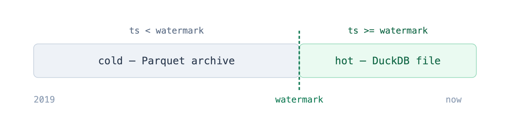
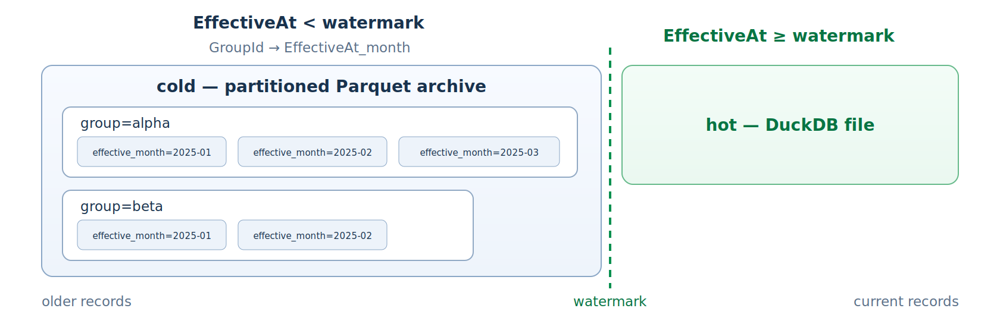

# DuckDB.EFCoreProvider

**An Entity Framework Core 10 provider with first-class support for [DuckDB](https://duckdb.org) and [DuckLake](https://ducklake.select), designed for analytical .NET workloads.**

[](https://www.nuget.org/packages/DuckDB.EFCoreProvider)
[](https://www.nuget.org/packages/DuckDB.EFCoreProvider.NTS)
[](https://learn.microsoft.com/ef/core/)
[](https://dotnet.microsoft.com/)
[](LICENSE)

[DuckDB.EFCoreProvider](https://www.nuget.org/packages/DuckDB.EFCoreProvider) provides LINQ queries, `SaveChanges`, native-DuckDB migrations, high-throughput ingestion, DuckLake catalogs, and Parquet-backed data lifecycle management through EF Core.

## Core capabilities

| Capability | Support |
|---|---|
| Application persistence | LINQ, `SaveChanges`, transactions, migrations, scaffolding, and optimistic concurrency |
| High-throughput ingestion | Write batching, appender-backed `BulkInsert`, and primary-key `Upsert` |
| Open-format analytics | Direct Parquet, CSV, and JSON queries, plus typed Parquet export |
| Lakehouse persistence | First-class DuckLake profile with tracked writes, transactions, appender ingestion, and `MERGE` upsert |
| Data lifecycle | Hot DuckDB tables with relational aggregates archived to partitioned Parquet |
| Operational controls | Memory limits, file search paths, extension loading, migration locking, and batch sizing |
| Data types | Decimal, temporal, JSON, arrays, lists, GUID, binary, row-value, and optional spatial mappings |

> **Workload scope:** DuckDB is a single-writer, embedded analytical engine. This provider is intended for analytics, reporting, embedded or edge stores, and Parquet-backed querying. It is not a replacement for a high-concurrency OLTP server database. See [Compatibility](#compatibility).

## Getting started

```bash
dotnet add package DuckDB.EFCoreProvider
```

Package Manager Console: `Install-Package DuckDB.EFCoreProvider`

The [`samples/Quickstart`](samples/Quickstart) console application provides runnable examples of database creation, standard writes, `BulkInsert`, and `Upsert`:

```bash
dotnet run --project samples/Quickstart
```

For the DuckLake backend profile, run `dotnet run --project samples/DuckLake`.

### Configure a record model

```csharp
using Microsoft.EntityFrameworkCore;

builder.Services.AddDbContext<SampleContext>(options =>
    options.UseDuckDB("Data Source=sample.duckdb"));

public sealed class SampleContext(DbContextOptions<SampleContext> options)
    : DbContext(options)
{
    public DbSet<Record> Records => Set<Record>();
    public DbSet<RecordPart> RecordParts => Set<RecordPart>();
}

public sealed class Record
{
    public int Id { get; set; }
    public required string ExternalKey { get; set; }
    public DateOnly CreatedOn { get; set; }
    public ICollection<RecordPart> RecordParts { get; } = [];
}

public sealed class RecordPart
{
    public int Id { get; set; }
    public int RecordId { get; set; }
    public required string Description { get; set; }
    public int Position { get; set; }
    public decimal Metric { get; set; }
    public Record Record { get; set; } = null!;
}
```

EF Core conventions map `Record` and `RecordPart` as a one-to-many aggregate. Standard LINQ and change tracking apply:

```csharp
var record = await db.Records
    .AsNoTracking()
    .Include(current => current.RecordParts)
    .SingleAsync(current => current.ExternalKey == "record-1001");

var aggregateMetric = record.RecordParts.Sum(part => part.Metric);
```

## DuckLake backend profile

DuckLake support is included in the same `DuckDB.EFCoreProvider` NuGet package. The convenience entry point
configures an in-memory DuckDB host, loads the `ducklake` extension, and ensures the catalog is attached and
selected before EF executes a command, including when a caller-owned connection is already open:

```csharp
using DuckDB.EFCoreProvider.Extensions;

builder.Services.AddDbContext<AnalyticsContext>(options =>
    options.UseDuckLake(
        "catalog/analytics.ducklake",
        duckLake => duckLake
            .CatalogName("analytics")
            .DataPath("data/analytics")));
```

Production deployments should configure remote metadata and object storage through a named DuckDB secret:

```csharp
options.UseDuckLake(
    duckLake => duckLake
        .UseNamedSecret("application_lake")
        .CreateIfNotExists(false),
    duckDB => duckDB.ConfigureConnection(connection =>
    {
        using var command = connection.CreateCommand();
        command.CommandText = BuildCreateSecretFromEnvironment();
        command.ExecuteNonQuery();
    }));
```

Supported workflows include LINQ, tracked `SaveChanges`, transactions, optimistic concurrency, initial
`EnsureCreated`, appender-backed `BulkInsert`, `MERGE`-backed `Upsert`, and read-only profiles. DuckLake does
not physically enforce keys, foreign keys, unique/check constraints, or indexes, and it does not support
sequences, store-generated values, or `RETURNING`. EF migrations, `EnsureDeleted`, scaffolding, provider tiered
storage, and `SaveChanges` batching are therefore deliberately unavailable in this profile. See the complete
[DuckLake configuration, security, and limitations guide](docs/DUCKLAKE.md).

## Configuration and connection strings

The connection string follows DuckDB.NET's format. Most deployments require only `Data Source`, set to a file path or `:memory:`:

| Goal | Connection string |
|---|---|
| **File database** (persisted) | `Data Source=app.duckdb` |
| **In-memory** (lifetime of the connection) | `Data Source=:memory:` |
| **Read-only** existing file | `Data Source=app.duckdb;Access Mode=READ_ONLY` |

> **`:memory:` lifetime** — an in-memory database lives only as long as the underlying connection is open. EF Core opens and closes connections per operation, so for a database that must persist *between* operations use a file, or keep a connection explicitly open (`context.Database.OpenConnection()`).

Provider behaviour is configured through the optional `UseDuckDB(connectionString, duckdb => …)` builder:

| Option | What it does | Default |
|---|---|---|
| `.EnableBulkInsertBatching()` | Merge consecutive `SaveChanges` inserts into one multi-row statement (~10× faster). | off |
| `.EnableBulkUpdateBatching()` | Merge eligible `SaveChanges` updates into one statement (~8× faster). | off |
| `.EnableBulkDeleteBatching()` | Merge eligible `SaveChanges` deletes into one statement (~14× faster). | off |
| `.MemoryLimit("4GB")` | Cap DuckDB's buffer-manager memory. Accepts `"512MB"`, `"75%"`, etc. | 80% of RAM |
| `.FileSearchPath("/data")` | Base directory (or comma-separated directories) for resolving relative file paths. | DuckDB default |
| `.MigrationLockTimeout(TimeSpan.FromMinutes(10))` | Maximum wait for the migrations lock before failing with guidance (use `Timeout.InfiniteTimeSpan` to wait forever). | 5 minutes |
| `.EnableMigrationTableRebuilds()` | Opt in to rebuilding tables for constraint changes DuckDB cannot apply in place. | off |
| `.LoadExtension("httpfs")` | Install and load a DuckDB extension whenever the connection opens. | none |
| `.LoadExtension("httpfs", DuckDBExtensionLoadMode.LoadOnly)` | Load a preinstalled extension without downloading it; `CallerManaged` records the dependency without running SQL. | install and load |
| `.ConfigureConnection(connection => …)` | Run provider-owned connection setup after extensions load; intended for `CREATE SECRET` and similar setup. | none |
| `.UseNetTopologySuite()` | Enable spatial support (requires the `DuckDB.EFCoreProvider.NTS` package). | off |
| `.MaxBatchSize(n)` | Tune the batching merge size (standard EF Core option). | 100 |

```csharp
options.UseDuckDB(
    "Data Source=app.duckdb",
    duckdb => duckdb
        .EnableBulkInsertBatching()
        .MemoryLimit("4GB")
        .FileSearchPath("/data,/data/archive"));
```

The batching, memory, and file-search options are explained in detail under [Performance](#performance) and [Memory limit and file search path](#memory-limit-and-file-search-path).

## Data workflows

The provider supports standard EF Core persistence together with DuckDB-specific ingestion, file-query, and archival workflows. See the [capability map](docs/CAPABILITY-MAP.md) for the detailed support matrix and documented engine limitations.

### Export a query to Parquet

```csharp
await context.Database.ExportToParquetAsync(
    context.Events.Where(e => e.Timestamp < cutoff),
    "/data/archive/events",
    options => options
        .PartitionBy(e => e.Category)
        .OverwriteOrIgnore()
        .Compression(DuckDBParquetCompression.Zstd),
    cancellationToken);
```

Values in the LINQ query remain command parameters. Destination paths are escaped as SQL literals and typed
partition expressions are resolved through EF's column mappings. `PartitionBy` uses exact projected column values,
so prefer stable, low-cardinality keys such as category, tenant, or region rather than a high-cardinality timestamp.
For provider-managed calendar partitions and unified hot+cold reads, use `ToTieredStore` with `ArchiveTierAsync`
instead.

## Implementation patterns

### Generated keys and `RETURNING`

Use `UseAutoIncrement()` for DuckDB-backed generated integer keys. The provider generates sequence-backed migrations and uses `RETURNING` so EF Core receives generated values after `SaveChanges`.

```csharp
using DuckDB.EFCoreProvider.Extensions;
using Microsoft.EntityFrameworkCore;

public class RecordsContext : DbContext
{
    public DbSet<Record> Records => Set<Record>();

    protected override void OnConfiguring(DbContextOptionsBuilder options)
        => options.UseDuckDB("Data Source=records.duckdb");

    protected override void OnModelCreating(ModelBuilder modelBuilder)
    {
        modelBuilder.Entity<Record>(entity =>
        {
            entity.HasKey(e => e.Id);
            entity.Property(e => e.Id).UseAutoIncrement();
            entity.Property(e => e.ReferenceCode).IsConcurrencyToken();
        });
    }
}

public class Record
{
    public int Id { get; set; }
    public required string ReferenceCode { get; set; }
}
```

### Query Parquet, CSV, and JSON files

Map an entity directly to a file (or glob pattern) and DuckDB reads it as a table — no physical table required. Use `[FromParquet]`, `[FromCsv]`, or `[FromJsonFile]`; DuckDB auto-detects the CSV/JSON schema and column types. Query SQL uses `read_parquet(...)`, `read_csv(...)`, or `read_json(...)`.

```csharp
using DuckDB.EFCoreProvider.Metadata;
using Microsoft.EntityFrameworkCore;

[FromParquet("data/records/*.parquet")]
public class RecordSnapshot
{
    public int Id { get; set; }
    public required string ReferenceCode { get; set; }
}

[FromCsv("data/groups.csv")]
public class Group
{
    public int Id { get; set; }
    public required string Name { get; set; }
}

[FromJsonFile("data/events.json")]
public class AuditEvent
{
    public int Id { get; set; }
    public required string Kind { get; set; }
}

public class AnalyticsContext : DbContext
{
    public DbSet<RecordSnapshot> RecordSnapshots => Set<RecordSnapshot>();
    public DbSet<Group> Groups => Set<Group>();
    public DbSet<AuditEvent> AuditEvents => Set<AuditEvent>();

    protected override void OnConfiguring(DbContextOptionsBuilder options)
        => options.UseDuckDB("Data Source=:memory:");
}
```

Use the fluent API instead when the path is configured at runtime:

```csharp
using DuckDB.EFCoreProvider.Extensions;

protected override void OnModelCreating(ModelBuilder modelBuilder)
{
    modelBuilder.Entity<RecordSnapshot>().FromParquet("data/records/*.parquet");
    modelBuilder.Entity<Group>().FromCsv("data/groups.csv");
    modelBuilder.Entity<AuditEvent>().FromJsonFile("data/events.json");
}
```

### Tiered storage (hot tables + cold Parquet)

The [tiered-storage compatibility matrix](docs/TIERED-STORAGE-COMPATIBILITY.md) lists the supported registration,
partition, query, lifecycle, and object-store combinations and their acceptance requirements.

Keep recent records hot in the writable DuckDB file and archive older records and their parts to
hive-partitioned Parquet. The offload is **idempotent and crash-safe**. Full guide:
[docs/TIERED-STORAGE.md](docs/TIERED-STORAGE.md).





The application may expose two record query paths:

- `Records` queries the normal `Record` entity in the hot DuckDB table. It supports writes, relationships,
  and `Include(i => i.Parts)`.
- `RecordHistory` queries a keyless `RecordHistory` model across the hot table and Parquet archive.

`.WithReadModel<RecordHistory>()` connects the `RecordHistory` model to the provider-generated hot+cold view.
When the application does not want a duplicate CLR projection, `.WithTieredView()` creates and maintains the same
physical view without adding another entity type to this EF model. A separate keyless context can then map the
application's existing entity type to that view.

```csharp
using DuckDB.EFCoreProvider.Extensions;
using DuckDB.EFCoreProvider.Metadata;
using Microsoft.EntityFrameworkCore;

public class SampleContext : DbContext
{
    // Hot Record entities.
    public DbSet<Record> Records => Set<Record>();

    // Read-only Record rows from hot DuckDB + cold Parquet.
    public DbSet<RecordHistory> RecordHistory => Set<RecordHistory>();

    protected override void OnConfiguring(DbContextOptionsBuilder options)
        => options.UseDuckDB("Data Source=sample.duckdb");

    protected override void OnModelCreating(ModelBuilder modelBuilder)
    {
        // EffectiveAt defines the watermark; the ordered builder defines the physical Hive hierarchy.
        modelBuilder.ToTieredStore<Record>(i => i.EffectiveAt, "/var/data/archive/records", TierGranularity.Month)
            .PartitionBy(partitions => partitions
                .By(i => i.GroupId)
                .ByMonth(i => i.EffectiveAt))
            .WithReadModel<RecordHistory>()
            // Cold: RecordParts archive together with their Record.
            .Including<RecordPart>(i => i.Parts);
    }
}
```

The view-only form keeps the writable model free of duplicate history classes:

```csharp
static void ConfigureRecordPartitions(TieredPartitionBuilder<Record> partitions)
    => partitions.ByMonth(record => record.EffectiveAt);

// Writable owner context: Record remains a keyed table entity.
modelBuilder.ToTieredStore<Record>(record => record.EffectiveAt, archivePath)
    .PartitionBy(ConfigureRecordPartitions)
    .WithTieredView() // records_tiered
    .Including<RecordPart>(record => record.Parts, part => part.WithTieredView());

// Separate read-only context: keyless mapping plus equivalent provider-derived pruning.
modelBuilder.Entity<Record>(record =>
{
    record.ToTieredView("records_tiered", ConfigureRecordPartitions);
    record.Ignore(row => row.Parts); // the application owns navigation treatment and historical joins
});
```

`ToTieredView(...)` records the same physical partition plan in the read-only model, so predicates on source
properties receive the same provider-derived Hive-bucket predicates as queries in the tier-owning model. Reusing one
configuration delegate keeps both declarations aligned. The provider also publishes a contract marker derived from
the resolved physical columns, order, transforms, aliases, and store types. A read-only query references that marker
whenever it adds a pruning predicate, so a stale or differently mapped context fails explicitly instead of silently
filtering valid history. Refresh the owner-managed views before deploying a reader built against a changed partition
contract; the read-only context cannot infer model metadata from a different `DbContext` by itself.

`WithTieredView("record_history")` selects an explicit unqualified physical name. Repeated registration is
idempotent when the name agrees; conflicting names fail, including conflicts beneath different roots that share one
descendant entity. When a custom view is also mapped with `WithReadModel<T>()`, call `WithTieredView(name)` first so
both registrations use the same physical name. Renaming a deployed view creates the new view but does not drop the
old object; remove the old view only after its consumers have migrated.

The lifecycle selector may target `DateTime`, `DateOnly`, or their nullable forms; `NULL` roots
and their children remain permanently hot until the application supplies a date. When the source system's stable
identity differs from an EF surrogate primary key,
add `.MatchBy(i => i.ExternalKey)` on the root and, independently, a single or anonymous-object composite key on each
included child that needs it. Match keys require a declared EF key/unique index unless the application explicitly
uses `TierMatchKeyUniqueness.ExternallyEnforced`; archiveable key values must still be non-null. See the
[tiered-storage guide](docs/TIERED-STORAGE.md#stable-hotcold-match-keys) for correction/reopen behavior and the
late-row boundary.

For example, a nullable lifecycle date stays hot while it is `NULL`, an external identity is used instead of a
generated EF key, and the child uses its own composite stable identity:

```csharp
modelBuilder.Entity<Record>()
    .HasIndex(record => record.ExternalKey)
    .IsUnique();
modelBuilder.Entity<RecordPart>()
    .HasIndex(part => new { part.RecordExternalKey, part.PartNumber })
    .IsUnique();

modelBuilder
    .ToTieredStore<Record>(
        record => record.EffectiveAt, // DateTime?: NULL remains hot
        "s3://record-archive/records",
        TierGranularity.Month)
    .MatchBy(record => record.ExternalKey)
    .PartitionBy(partitions => partitions
        .By(record => record.GroupId, "root_group_id")
        .ByMonth(record => record.EffectiveAt, "effective_month"))
    .WithReadModel<RecordHistory>()
    .Including<RecordPart>(
        record => record.Parts,
        parts => parts
            .MatchBy(part => new { part.RecordExternalKey, part.PartNumber })
            .WithReadModel<RecordPartHistory>());
```

The optional names are physical Hive directory/virtual-column aliases; EF queries continue to use `GroupId` and
`EffectiveAt`. This is useful when a child already maps a column such as `GroupId`: naming the inherited root
partition `root_group_id` avoids replacing or colliding with the child's own data. For one exact key plus the
implicit lifecycle bucket, use `.PartitionBy(record => record.GroupId, "root_group_id")`.

A shared child entity/table can be included beneath multiple independent tiered roots. The provider retains a
deterministic binding for every root relationship and builds one combined child history view over the hot table
plus all published root-specific archives. Archive and maintenance operations remain root-scoped. Each physical
child row must resolve to at most one root; preflight and mutating operations reject ambiguous rows before any
Parquet write or hot deletion. See
[sharing one child entity across independent roots](docs/TIERED-STORAGE.md#sharing-one-child-entity-across-independent-roots).

```csharp
db.Database.EnsureCreated();                 // creates the control table + hot/cold view
// (when using Migrate() instead, call db.Database.EnsureTieredStoresCreated() once at startup)

// Move records older than one year from hot DuckDB tables to cold Parquet.
// On successful return, the archived Records and RecordParts have been deleted from DuckDB.
var archiveCutoff = DateTime.UtcNow.AddYears(-1);
var result = await db.Database.ArchiveTierAsync<Record>(
    archiveCutoff,
    new TierArchiveOptions
    {
        Writer = new TierParquetWriterOptions
        {
            Compression = "zstd",
            CompressionLevel = 5,
            RowGroupSize = 122_880,
        },
        Manifest = new TierManifestOptions
        {
            Detail = TierManifestDetail.RepresentativeFiles,
            MaxFilesPerNode = 10,
        },
    });

foreach (var node in result.Nodes)
{
    Console.WriteLine(
        $"{node.Table}: selected={node.SelectedRows}, copied={node.CopiedRows}, "
        + $"deleted={node.DeletedRows}, files={node.Files.Count}");
}

// After validating late rows or corrections below the watermark, publish a new immutable cold generation.
var reconciliation = await db.Database.ReconcileArchiveTierAsync<Record>();

// Limit an approved correction to exact configured root match keys.
var scoped = await db.Database.ReconcileArchiveTierAsync<Record>(
    new TierReconciliationOptions
    {
        Scope = TierMaintenanceScope.ForRootMatchKeys(
            TierRowIdentity.For<Record>(
                new Dictionary<string, object?> { ["ExternalKey"] = recordExternalKey })),
    });

// Explicitly remove a provider row; absence from a hot collection is never interpreted as deletion.
var deleted = await db.Database.ReconcileArchiveTierAsync<Record>(
    new TierReconciliationOptions
    {
        Tombstones =
        [
            TierRowIdentity.For<RecordPart>(
                new Dictionary<string, object?>
                {
                    ["RecordExternalKey"] = recordExternalKey,
                    ["PartNumber"] = partNumber,
                }),
        ],
    });

// Restore one archived aggregate graph to mapped hot tables without changing domain values.
var restored = await db.Database.RestoreArchiveTierAsync<Record>(
    new TierRestoreOptions
    {
        Scope = TierMaintenanceScope.ForRootMatchKeys(
            TierRowIdentity.For<Record>(
                new Dictionary<string, object?> { ["ExternalKey"] = recordExternalKey })),
    });

// Operational diagnostics stay bounded.
var conflicts = await db.Database.GetArchiveConflictsAsync<Record>(offset: 0, limit: 100);
var detached = await db.Database.GetArchiveDetachedDescendantsAsync<Record>(offset: 0, limit: 100);
var inventory = await db.Database.GetArchiveGenerationInventoryAsync<Record>();
var cleanup = await db.Database.PlanArchiveGenerationCleanupAsync<Record>(selectedGenerationIds);
cleanup = await db.Database.RevalidateArchiveGenerationCleanupPlanAsync<Record>(cleanup);
var preflight = await db.Database.PreflightTieredStorageAsync<Record>();

// Persist this serializable checkpoint outside the DuckDB database after each successful publication.
var recoveryCheckpoint =
    await db.Database.CaptureArchiveRecoveryCheckpointAsync<Record>();

// After verified local Provider-metadata loss, the Provider re-derives every path and revalidates exact evidence.
var recoveryPlan =
    await db.Database.PlanArchiveRecoveryAsync<Record>(persistedRecoveryCheckpoint);
var recoveredInventory =
    await db.Database.ApplyArchiveRecoveryAsync<Record>(recoveryPlan);

// Records: hot only, with their RecordParts. Parquet is not queried.
var hotRecords = await db.Records
    .Include(i => i.Parts)
    .ToListAsync();

// RecordHistory: hot + Parquet. No timestamp filter is required.
var allRecords = await db.RecordHistory.ToListAsync();

// RecordHistory with a date range: DuckDB can skip irrelevant monthly Parquet data.
var from = new DateTime(2024, 1, 1);
var toExclusive = new DateTime(2024, 4, 1);
var rangedRecords = await db.RecordHistory
    .Where(i => i.EffectiveAt >= from && i.EffectiveAt < toExclusive)
    .ToListAsync();
```

The `EffectiveAt` filter is optional. With the declared `GroupId` → record-month layout, group-only queries
scan that group's month partitions; adding a date range lets DuckDB prune to the relevant months. The order is
application-defined: reversing the builder calls reverses the directory hierarchy. The shorter
`.PartitionBy(i => i.GroupId)` form means an exact group key followed by an implicit lifecycle month/day
bucket.

Notice `ArchiveTierAsync<Record>` (and `PurgeArchiveOlderThan<Record>`) take **no path** — only the cutoff. The
*where* (the archive path) and the *which date* (the timestamp property) come from the `ToTieredStore<Record>(...)`
configuration, looked up by the root type; the runtime call supplies only the *when*. The cutoff is an exclusive
`DateTime` boundary, not a duration. The provider aligns it down to the configured granularity: with
`TierGranularity.Month`, `new DateTime(2025, 7, 15)` becomes `2025-07-01`, and rows with an `EffectiveAt` before
July are archived. To archive all of June 2025, pass `new DateTime(2025, 7, 1)`. Each table in the aggregate archives
under `<archivePath>/<table>/GroupId=…/EffectiveAt_month=…/`, and the generated views read back from the same
path, so reads and writes always agree on the location. Partition configuration exists only on the aggregate root;
declared children inherit the root values and order.

`ArchiveTierAsync` is a complete hot-to-cold move, not a copy-only operation. It writes the root and all declared
children to Parquet, advances the watermark, refreshes the hot+cold views, and then deletes the archived rows from
the hot DuckDB tables before returning successfully. No separate `RemoveRange`, `ExecuteDelete`, or SQL `DELETE`
is required. Queries through `Records` stop seeing those rows because that set is hot-only; queries through
`RecordHistory` continue seeing them through Parquet.

Run `ArchiveTierAsync` from a scheduled job in the writing process (DuckDB is single-writer).
Scheduling the cutoff one complete day/period behind the clock provides an ingestion grace window. It reduces
late arrivals but does not move rows that arrive after the watermark. Normal archiving leaves those rows hot and
stops on a same-key correction; after validation, `ReconcileArchiveTierAsync` writes and verifies a new immutable
Parquet generation, atomically switches readers, and then safely cleans matching hot copies. Lifecycle-date clears
or moves remain rejected because reopening requires restoring the complete aggregate. Successful operations return
per-table selected/copied/deleted counts, paths/files, window and watermark details; operational failures expose the
same safe partial evidence through `TierArchiveOperationException.PartialResult`.

Conflict handling is deliberately conservative:

- A new stable key below the watermark stays hot until reconciliation.
- The same stable key with identical data is a harmless retry and can be cleaned up safely.
- The same stable key with changed data throws `TierArchivedKeyConflictException`; the cold version remains
  published and the hot correction remains untouched for application validation.
- After approval, reconciliation writes a new Parquet generation and atomically switches readers to it.
- Reconciliation is a key-wise upsert. An absent hot child is not treated as a deletion; child removal needs an
  explicit tombstone or authoritative full-snapshot contract.

`ArchiveTierAsync`, `ReconcileArchiveTierAsync`, and `RestoreArchiveTierAsync` must run outside an application
transaction. Their Parquet writes are external side effects and cannot be rolled back with a DuckDB transaction.
Restore nevertheless commits its hot-table inserts and active-generation metadata/view switch in one internal
DuckDB transaction; a failed publication leaves the previous generation active and rolls the hot inserts back.

#### Archiving, bounded bootstrap, and retention

For an initial archive that must not publish rows older than an explicit lower bound, use the half-open
`BootstrapArchiveTierAsync<Record>(fromInclusive, cutoffExclusive)` operation. Its lower bound must align with the
configured month/day granularity and it is accepted only for the first publication or its exact idempotent retry.
The provider persists both bounds atomically with publication; a retry is exact only while the active watermark still
equals the original cutoff. Older rows stay hot and visible.

For logical cold-tier retention, plan and publish an immutable replacement generation:

```csharp
var plan = await db.Database.PlanArchiveRetentionAsync<Record>(
    new TierArchiveRetentionOptions
    {
        RetainFrom = retainFromUtc,
        RetainedPartitionScopes =
        [
            TierMaintenanceScope.ForPartitionValues(
                new Dictionary<string, object?> { [nameof(Record.GroupId)] = retainedGroupId }),
        ],
    });

var result = await db.Database.PublishArchiveRetentionAsync<Record>(plan);
```

The plan fingerprints the active generation, exact physical/provider catalogue, contracts, aligned lifecycle
boundary, exact declared-partition scopes, and root/descendant counts. Publication copies and verifies retained rows,
atomically switches provider metadata and views, and leaves the previous generation intact for rollback and
separately authorised cleanup. It never changes hot rows or assigns business meaning to the boundary/scopes.

`PurgeArchiveOlderThan<Record>` is the older local-filesystem-only in-place physical purge. It permanently deletes
cold Parquet partitions older than its cutoff, does not delete hot rows or change the archive watermark, and is not
supported for remote archives.

For example, a consumer may decide to keep records hot for 12 months and then cold for another 24 months:

```csharp
var now = DateTime.UtcNow;

// 0-12 months old: remain in hot DuckDB.
// More than 12 months old: move to Parquet and delete from the hot tables.
var archiveCutoff = now.AddMonths(-12);
await db.Database.ArchiveTierAsync<Record>(archiveCutoff);

// The application resolves policy/holds/approvals, then supplies technical inputs.
var plan = await db.Database.PlanArchiveRetentionAsync<Record>(
    new TierArchiveRetentionOptions { RetainFrom = now.AddMonths(-36) });
await db.Database.PublishArchiveRetentionAsync<Record>(plan);
```

Do not use the same cutoff for archive and retention or calculate the retention boundary with
`archiveCutoff.AddMonths(24)`: that moves the boundary forward and can immediately remove the history just archived
from the active representation.

> **Try it now.** The runnable [`samples/TieredStorage`](samples/TieredStorage) console app demonstrates archiving
> and reporting across hot + cold:
> ```bash
> dotnet run --project samples/TieredStorage          # cold archive on the local filesystem (no setup)
>
> # Remote modes: start local MinIO + Azurite, then run against one of them:
> docker compose -f samples/TieredStorage/docker-compose.yml up -d
> dotnet run --project samples/TieredStorage -- s3     # S3       (httpfs + MinIO)
> dotnet run --project samples/TieredStorage -- gcs    # GCS      (TYPE gcs + gcs:// through MinIO)
> dotnet run --project samples/TieredStorage -- azure  # Azure    (azure extension + Azurite)
> ```
> The remote modes target MinIO / Azurite by default. Override `TIER_S3_*`, `TIER_GCS_*`, or `TIER_AZURE_*`
> to point at real S3, Google Cloud Storage, or Azure.

**See the two tiers for yourself.** After a run, the hot rows are `BASE TABLE`s in the `.duckdb` file and the
cold rows are hive-partitioned Parquet in the archive; the generated `*_tiered` views union them. Inspect each
store directly with the [DuckDB CLI](https://duckdb.org/docs/stable/clients/cli/overview) (local mode shown —
no S3 credentials needed):

```bash
# Hot: rows physically in the DuckDB file, plus the watermark that splits hot from cold.
duckdb tiered_sample.duckdb -c "SELECT count(*) FROM Records; SELECT * FROM __duckdb_tier_control;"

# Cold: the Parquet the archive actually wrote (S3 mode: mc ls --recursive local/tier).
ls -R tiered_sample_archive/records/Records

# The view is exactly hot + cold — count all three side by side:
duckdb tiered_sample.duckdb -c "
SELECT (SELECT count(*) FROM Records)                                     AS hot_duckdb,
       (SELECT count(*) FROM read_parquet('tiered_sample_archive/records/Records/**/*.parquet',
                                          hive_partitioning = true))       AS cold_parquet,
       (SELECT count(*) FROM Records_tiered)                              AS union_view;"
#  hot_duckdb + cold_parquet == union_view   (e.g. 13 + 6 == 19)
```

`EXPLAIN SELECT * FROM Records_tiered` makes the union structural: a `UNION` of a `SEQ_SCAN` on the hot
`Records` table beside a `READ_PARQUET` over the archive. (In local mode the sample runs a retention purge at
the end, so some archived partitions are already gone when you look — `hot + cold == union` still holds, with
fewer cold rows; remote modes skip the purge, so you see the full archive.)

**Cold storage on S3, Google Cloud Storage, and Azure.** Point `archivePath` at an object-store URL — `s3://`,
`gcs://`/`gs://`, `r2://` (all via DuckDB's `httpfs` extension), or `az://`/`azure://`/`abfss://` (via the
separate `azure` extension) — and DuckDB reads and writes the archive there directly. Hot data stays in the
local file, cold data on cheap durable storage, one set of views over both. S3 uses a `TYPE s3` secret; GCS uses
a `TYPE gcs` secret with GCS interoperability (HMAC) credentials; Azure uses the `azure` extension and an
Azure-typed secret.

- **`ArchiveTierAsync` works against S3, GCS, and Azure as on local disk.** The sample verifies S3 and the GCS
  URL/secret path against MinIO and Azure against Azurite. MinIO is not a Google Cloud emulator, so use a real
  GCS bucket to validate Google IAM/HMAC and service-specific behavior before production.
- **The S3 failure matrix is reusable against MinIO and real AWS.** Run `scripts/test-tiered-storage-s3.sh` for
  MinIO. Setting `DUCKDB_AWS_S3_TEST_BUCKET` (plus optional prefix/region or paired explicit credentials) runs the
  same first-archive, no-op, restart, failure/retry, reconciliation, and schema-evolution scenarios against a
  unique disposable AWS prefix.
- **Immutable retention publication works on local and remote archives.** It creates and verifies a replacement
  generation, atomically switches the exact active catalogue/views, and leaves the obsolete generation untouched.
  `PurgeArchiveOlderThan` still throws for remote archives. Delete old objects only after generation cleanup inventory
  and separate application authorisation; do not apply blind upload-age expiry to an active archive prefix.

Full guide: [Cold storage on S3 and GCS](docs/TIERED-STORAGE.md#6-cold-storage-on-s3-google-cloud-storage-and-other-object-stores);
the sample above runs the GCS path with `-- gcs`.

**Child view guard (advanced).** In an aggregate, a child row is shown as hot only when its root is on the hot
side of the boundary — a semijoin that keeps reports correct even in the brief window if an archive process
dies between writing Parquet and deleting the hot rows. For deep aggregates where that per-query guard costs
more than it's worth, opt out with `.WithoutHotChildFilter()`; child views become a plain `SELECT * FROM child`,
and the next `ArchiveTierAsync` still self-heals any transient double-count.

```csharp
modelBuilder.ToTieredStore<Record>(i => i.EffectiveAt, "/var/data/archive/records", TierGranularity.Month)
    .WithoutHotChildFilter()                        // trade the crash-window guard for faster child reads
    .WithReadModel<RecordHistory>()
    .Including<RecordPart>(i => i.Parts, part => part.WithReadModel<RecordPartReport>());
```

### Bulk insert

For high-throughput loading, `BulkInsert` / `BulkInsertAsync` append rows directly through DuckDB's columnar `Appender` — much faster than `SaveChanges` for large batches. It is a deliberate raw fast path: it bypasses the change tracker, concurrency checks, interceptors, and store-generated values (provide a value for every mapped column), and the target table must already exist.

```csharp
using DuckDB.EFCoreProvider.Extensions;

using var context = new TelemetryContext();
context.Database.EnsureCreated();

var rows = Enumerable.Range(1, 100_000)
    .Select(i => new Measurement { Id = i, Sensor = $"s{i % 10}", Value = i * 0.5 })
    .ToList();

var inserted = context.BulkInsert(rows);
// or: var inserted = await context.BulkInsertAsync(rows);
```

### Upsert

`Upsert` / `UpsertAsync` insert the supplied entities and update any whose primary key already exists. Each
batch is staged into a temporary table with DuckDB's appender API, then merged into the target table with a
set-based `INSERT ... ON CONFLICT (key) DO UPDATE`. This replaces the usual read-then-insert-or-update
pattern — it removes the existence-check round-trip and batches the writes, running roughly an order of
magnitude faster in local measurements. The conflict target is the entity's primary key (whose values you
supply), and all mapped non-key columns are overwritten from the supplied values; an entity with only key
columns becomes `ON CONFLICT DO NOTHING`.

```csharp
using DuckDB.EFCoreProvider.Extensions;

using var context = new TelemetryContext();

var rows = new[]
{
    new Measurement { Id = 1, Sensor = "s1", Value = 1.5 }, // updated if Id 1 exists
    new Measurement { Id = 2, Sensor = "s2", Value = 2.5 }, // inserted if Id 2 is new
};

var processed = context.Upsert(rows);
// or: var processed = await context.UpsertAsync(rows);
// batch size is configurable: context.Upsert(rows, batchSize: 200);
```

Like `BulkInsert`, this is a raw fast path: it bypasses the change tracker, concurrency checks, and
interceptors, requires primary-key values (store-generated keys are not supported), and does not support
shadow or database-computed columns.

### JSON, owned JSON, and arrays

DuckDB JSON columns can be mapped to `string`, `JsonDocument`, or `JsonElement`. EF Core owned JSON documents are supported through `ToJson()`, and CLR arrays/lists map to DuckDB array types.

```csharp
using System.Text.Json;
using Microsoft.EntityFrameworkCore;

public class EventRecord
{
    public int Id { get; set; }
    public JsonDocument? Payload { get; set; }
    public List<int> Scores { get; set; } = [];
    public EventDetails Details { get; set; } = new();
}

public class EventDetails
{
    public string? Source { get; set; }
    public string[] Tags { get; set; } = [];
}

protected override void OnModelCreating(ModelBuilder modelBuilder)
{
    modelBuilder.Entity<EventRecord>(entity =>
    {
        entity.Property(e => e.Payload).HasColumnType("JSON");
        entity.Property(e => e.Scores).HasColumnType("INTEGER[]");
        entity.OwnsOne(e => e.Details, owned => owned.ToJson());
    });
}
```

### Spatial queries

Spatial support lives in the separate `DuckDB.EFCoreProvider.NTS` project and assembly. Reference that
project/assembly to enable it. It enables the DuckDB spatial extension and maps NetTopologySuite geometry
members/methods into DuckDB spatial SQL.
Geometry is stored in DuckDB's native `GEOMETRY` column type; WKT text is used only as the wire format
to and from the driver (reads project `ST_AsWKT(...)`, writes wrap `ST_GeomFromText(...)`), because
DuckDB.NET cannot yet read the native binary geometry type directly.

```csharp
using DuckDB.EFCoreProvider.NTS.Extensions;
using Microsoft.EntityFrameworkCore;
using NetTopologySuite.Geometries;

builder.Services.AddDbContext<SpatialContext>(options =>
    options.UseDuckDB(
        "Data Source=spatial.duckdb",
        duckdb => duckdb.UseNetTopologySuite()));

public class Site
{
    public int Id { get; set; }
    public Point Location { get; set; } = null!;
}
```

### Memory limit and file search path

By default DuckDB sizes its buffer manager to **80% of physical RAM**. To cap that — useful when DuckDB shares
a host with other services — set `MemoryLimit`. To resolve relative file paths (for example in `[FromParquet]`)
against a base directory rather than the process working directory, set `FileSearchPath`. Both are applied as
DuckDB settings when each connection opens:

```csharp
builder.Services.AddDbContext<ReportingContext>(options =>
    options.UseDuckDB(
        "Data Source=app.duckdb",
        duckdb => duckdb
            .MemoryLimit("4GB")                  // also accepts e.g. "512MB", "75%"
            .FileSearchPath("/data,/data/archive")));  // one or more comma-separated directories
```

When not configured, DuckDB's defaults are left untouched. DuckDB spills larger-than-memory intermediates to
its temp directory, so a lower memory limit trades memory for more disk spilling on big analytical queries
rather than failing. (For an in-memory database — `Data Source=:memory:` — spilling requires a
`temp_directory`, which DuckDB does not set automatically.)

## Compatibility

This provider targets EF Core 10.0.x and .NET 10. DuckDB is an embedded analytical database, so some relational features differ from server databases. Unsupported DuckDB features should fail clearly or be documented as provider limitations.

For the full feature support matrix, the DuckDB engine limitations, and the roadmap, see
[docs/CAPABILITY-MAP.md](docs/CAPABILITY-MAP.md). For the `dotnet ef` migrations workflow and its
DuckDB-specific details, see the [migrations guide](docs/MIGRATIONS.md). See also
[CHANGELOG.md](CHANGELOG.md) for release history, [VERSIONING.md](VERSIONING.md) for the
versioning / breaking-change policy, and [SECURITY.md](SECURITY.md) for vulnerability reporting.

## Performance

DuckDB is a columnar analytical engine, which shapes performance:

- **Analytical reads** align with DuckDB's columnar execution model.
- **Bulk loading** via `BulkInsert` / `BulkInsertAsync` (the DuckDB `Appender`) is roughly **two orders of
  magnitude faster** than looping `SaveChanges` (~1M rows/s vs ~6–8k rows/s in local measurements). Use it
  for ETL and large batches.
- **High-frequency small `SaveChanges` writes are slow** — DuckDB is not optimised for many single-row
  `INSERT` statements. This is inherent to the engine, not the provider.

### Faster `SaveChanges` inserts, updates, and deletes

DuckDB is a columnar engine, so the default one-statement-per-row path that EF Core uses for `SaveChanges` is
slow for inserts, updates, and deletes. Three independent, opt-in options merge consecutive operations within
a save into a single multi-row statement:

```csharp
options.UseDuckDB(
    "Data Source=app.duckdb",
    duckdb => duckdb
        .EnableBulkInsertBatching()   // INSERT INTO t (..) VALUES (..),(..),..
        .EnableBulkUpdateBatching()   // UPDATE t SET .. FROM (VALUES (..),(..)) ..
        .EnableBulkDeleteBatching()); // DELETE FROM t WHERE key IN (..)
```

- **An order of magnitude faster** in local measurements (all while **keeping change tracking and
  store-generated keys**, unlike `BulkInsert`):
  - inserts ~120k rows/s (vs ~12k),
  - updates ~52k rows/s (vs ~6k),
  - deletes ~119k rows/s (vs ~9k) — delete batching is especially effective for **orphan cleanup** and
    **child-collection replacement**, which issue one delete per orphaned row by default.
- **All disabled by default**, and independent (enable any combination). When enabled, each merged run is
  **atomic**: if any row in the run fails, none of the rows in that run are applied, even when `SaveChanges`
  runs without an enclosing transaction. This differs from EF Core's default behaviour (where a failed save
  without a transaction can leave earlier rows applied), which is why it is opt-in. Under EF Core's default
  `AutoTransactionBehaviour.WhenNeeded`, multi-row saves are already transactional, so most applications see no
  behavioural difference.
- **Update and delete batching apply only to safe operations** — those whose `WHERE` clause is the primary
  key (and, for updates, which read no database-computed values back). Operations that use **concurrency
  tokens** (or, for updates, **computed columns**) automatically fall back to the standard per-row path, so
  their concurrency-detection and value-propagation behaviour is unchanged.
- Tune the merge size with the standard `MaxBatchSize` option. The default of 100 is based on local benchmark
  results; very large batches regress.
- For pure bulk inserts that do not need change tracking or generated values, `BulkInsert` (below) is faster
  still.

### When to use `BulkInsert` (batch size)

`SaveChanges` costs ~87 µs per row in local measurements because each row is a round-trip. `BulkInsert` has a
small fixed per-call cost (~200 µs once warm) and substantially lower incremental row cost:

| Batch size | Recommendation |
|---|---|
| **< ~5 rows** | Either is fine; prefer `SaveChanges` (you keep change tracking, generated keys, concurrency). |
| **≥ ~10 rows** | Use `BulkInsert` — already several× faster, and the gap grows with size. |
| **hundreds → millions** | Use `BulkInsert` in a single call (it streams internally; chunk only to bound memory). |

Rough throughput: `BulkInsert` ≈ 1M rows/s; `SaveChanges` ≈ 6–8k rows/s. Use a single `BulkInsert` call rather
than repeated `SaveChanges` calls for bulk loads. A BenchmarkDotNet project lives in `test/DuckDB.EFCoreProvider.Benchmarks`; see
[docs/PERFORMANCE.md](docs/PERFORMANCE.md) for full results, the crossover table, methodology, and guidance.

## Testing

The repository includes EF Core relational specification coverage plus DuckDB-specific write-provider tests. Use the test-suite script for repeatable local and CI runs:

```bash
scripts/test-suite.sh write-critical
scripts/test-suite.sh write-broad
scripts/test-suite.sh migrations
scripts/test-suite.sh updates
scripts/test-suite.sh all
scripts/test-suite.sh full-project
```

`write-critical` is the minimum gate for write-provider changes. It covers SQL generation, `RETURNING`, generated keys, optimistic concurrency, generated-key migrations, model validation, and read-only existence checks.

`all` is the complete production write-provider gate and is intended to stay green in CI. `full-project` runs the raw EF Core functional test project for broader provider-backlog discovery; it includes unrelated query/spec coverage that may fail until those areas are implemented.

## Troubleshooting and FAQ

**`IOException` / "Could not set lock on file" / "database is locked".** DuckDB is **single-writer**: only one process can open a file database for writing at a time. Close other writers (including an open DuckDB CLI, a second app instance, or a held-open connection) before writing or running migrations. Multiple **readers** are fine with `Access Mode=READ_ONLY`.

**My in-memory data disappeared.** `Data Source=:memory:` lives only while its connection is open, and EF Core opens/closes connections per operation. Use a file database, or call `context.Database.OpenConnection()` to keep one connection open for the lifetime you need. See [Configuration and connection strings](#configuration-and-connection-strings).

**My `[FromParquet]` / `[FromCsv]` relative path isn't found.** Relative paths resolve against the process working directory by default. Set a base directory with `.FileSearchPath("/data")`, or use absolute paths. See [Query Parquet, CSV, and JSON files](#query-parquet-csv-and-json-files).

**`SaveChanges` is slow for many rows.** That is inherent to DuckDB's columnar engine, not the provider. Turn on `.EnableBulkInsertBatching()` (and the update/delete equivalents) to keep change tracking while merging writes, or use `BulkInsert` / `Upsert` for raw throughput. See [Performance](#performance).

**`UseDuckDB` / `BulkInsert` / `UseAutoIncrement` not found.** Add `using DuckDB.EFCoreProvider.Extensions;`.

**`BulkInsert` or `Upsert` throws about a missing key or column.** Both are raw fast paths that bypass change tracking and store-generated values: supply primary-key values yourself (configure the key as `ValueGeneratedNever()`), provide a value for every mapped column, and ensure the target table already exists. See [Bulk insert](#bulk-insert) and [Upsert](#upsert).

**Migrations.** For the `dotnet ef` workflow, generated keys, and the DuckDB-specific `ALTER TABLE`/index limitations, see the [migrations guide](docs/MIGRATIONS.md).

**A LINQ query throws a "could not be translated" error.** DuckDB is analytical and a few relational constructs differ from server databases. Check the [capability map](docs/CAPABILITY-MAP.md); as a workaround, materialise earlier (e.g. `AsEnumerable()`) or use a raw SQL query.

## Operations and support

This is a community open-source project, maintained on a best-effort basis. It is **not** affiliated with, or supported by, Microsoft, the .NET Foundation, or the DuckDB project, and it does **not** come with a commercial support contract or SLA.

Operational implications:

- **Support is best-effort.** Issues and pull requests are handled as maintainer time allows. There is no guaranteed response or resolution time.
- **Bus factor is low.** Day-to-day maintenance currently rests with a small number of contributors. If you depend on this provider in production, plan accordingly: pin versions, vendor or fork if you need guarantees, and budget for the possibility of maintaining patches yourself.
- **Versioning.** The package follows semantic versioning. Breaking changes will be reserved for major version bumps where practical; review the release notes before upgrading.
- **Production fit.** DuckDB is an embedded, single-writer analytical (OLAP) database. This provider is intended for analytics, reporting, embedded or edge stores, and Parquet-backed querying. It is **not** a replacement for a server database in high-concurrency, multi-writer OLTP scenarios. See [Compatibility](#compatibility).

Contributions are welcome. If your organisation relies on this provider, contributing fixes, tests, and review is the most effective way to keep it healthy.

## Acknowledgments

This project began as a fork of [**DuckDB.EFCore**](https://github.com/denis-ivanov/DuckDB.EFCore) by [**Denis Ivanov**](https://github.com/denis-ivanov). It is distributed under the same MIT licence; the original copyright notice is retained in [**LICENSE**](https://www.nuget.org/packages/DuckDB.EFCoreProvider.NTS).

This provider is built on top of the [DuckDB.NET](https://github.com/Giorgi/DuckDB.NET) ADO.NET provider.
