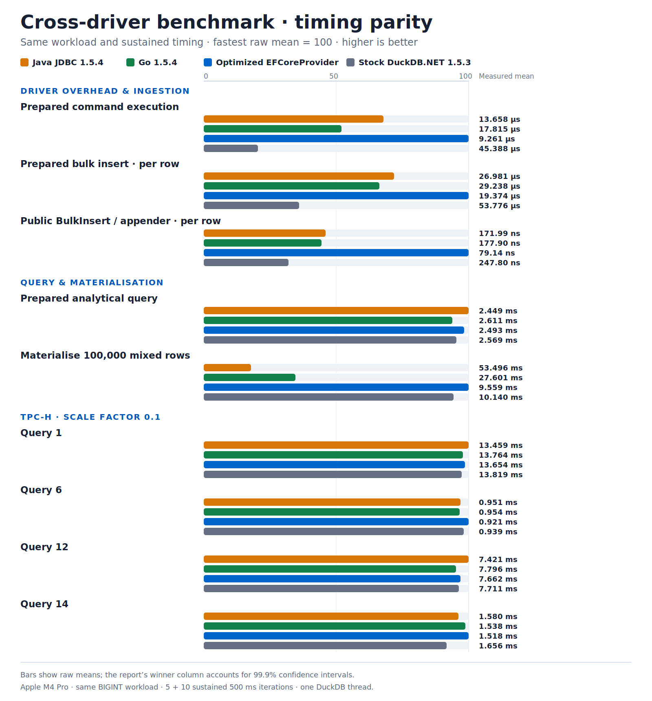

# DuckDB cross-driver benchmark: optimized EFCoreProvider

Date: 24 July 2026

## Result

With the workload and timing corrected, the normal optimized provider source
build wins the two scenarios that matter most to the optimization:

- **Prepared command execution:** 9.261 ± 0.136 µs, versus Java at
  13.658 ± 0.156 µs and Go at 17.815 ± 0.288 µs.
- **Public `DbContext.BulkInsert`:** 79.14 ± 1.10 ns/row, versus Java's
  idiomatic appender at 171.99 ± 6.49 ns/row and Go's at
  177.90 ± 2.56 ns/row.

Stock DuckDB.NET 1.5.3 takes 45.39 ± 1.35 µs for the prepared-command shape
because `Prepare()` was effectively a no-op in that release. Skuirrels 1.5.5
executes the prepared native statement and is 4.90 times faster in this run.

This result supersedes the earlier 24 July chart. That run forced
`InvocationCount = 1` and `UnrollFactor = 1` for .NET, so each .NET iteration
contained one cold operation while Java and Go executed continuously for
500 ms. It also used 32-bit integers in .NET but 64-bit integers in Java and
Go. The corrected harness gives every driver the same sustained timing
contract and the same three-`BIGINT` scalar query.

## Row-by-row comparison

Lower is better. Every value is the arithmetic mean with its 99.9% confidence
interval half-width. `No meaningful winner` is used when the leading
confidence intervals overlap.

| Scenario | Java JDBC 1.5.4 | Go 1.5.4 | Optimized EFCoreProvider source | Stock DuckDB.NET 1.5.3 | Winner |
|---|---:|---:|---:|---:|---|
| Prepared command execution | 13.658 ± 0.156 µs | 17.815 ± 0.288 µs | **9.261 ± 0.136 µs*** | 45.388 ± 1.349 µs | **EFCoreProvider dependency** |
| Prepared bulk insert, per row | 26.981 ± 0.142 µs | 29.238 ± 0.218 µs | **19.374 ± 0.144 µs*** | 53.776 ± 0.492 µs | **EFCoreProvider dependency** |
| Public `BulkInsert` / idiomatic appender, per row | 171.99 ± 6.49 ns | 177.90 ± 2.56 ns | **79.14 ± 1.10 ns** | 247.80 ± 2.90 ns | **Optimized EFCoreProvider** |
| Prepared analytical query | **2.449 ± 0.041 ms** | 2.611 ± 0.078 ms | 2.493 ± 0.075 ms* | 2.569 ± 0.105 ms | No meaningful winner between Java and the provider dependency |
| Materialise 100,000 mixed rows | 53.496 ± 0.829 ms | 27.601 ± 0.684 ms | **9.559 ± 0.126 ms*** | 10.140 ± 0.230 ms | **EFCoreProvider dependency** |
| TPC-H SF 0.1 Q1 | **13.459 ± 0.178 ms** | 13.764 ± 0.124 ms | 13.654 ± 0.194 ms* | 13.819 ± 0.195 ms | No meaningful winner |
| TPC-H SF 0.1 Q6 | 0.951 ± 0.072 ms | 0.954 ± 0.027 ms | **0.921 ± 0.033 ms*** | 0.939 ± 0.050 ms | No meaningful winner |
| TPC-H SF 0.1 Q12 | **7.421 ± 0.124 ms** | 7.796 ± 0.586 ms | 7.662 ± 0.222 ms* | 7.711 ± 0.161 ms | No meaningful winner |
| TPC-H SF 0.1 Q14 | 1.580 ± 0.065 ms | 1.538 ± 0.027 ms | **1.518 ± 0.011 ms*** | 1.656 ± 0.069 ms | No meaningful winner |

`*` The non-`BulkInsert` EFCoreProvider cells are the equivalent direct-driver
workloads through its Skuirrels DuckDB.NET 1.5.5 dependency. They do not
measure EF LINQ translation, change tracking, or entity materialisation.

## Provider provenance

The provider lane uses a normal project reference to the current
`src/DuckDB.EFCoreProvider/DuckDB.EFCoreProvider.csproj`. It does not use a
renamed, repacked, or benchmark-specific provider. The benchmark builds the
same optimized source that is in this workspace and labels it as a source
build; it does not claim this is an already-published NuGet binary.

The public ingestion row calls
`DbContext.BulkInsert(IEnumerable<TEntity>)`. Its warmed immutable EF column
plan writes each entity through the Skuirrels reusable appender callback.

## Fair timing and workload controls

Every driver now uses:

1. the same three-`BIGINT` prepared scalar query and 64-bit values;
2. one verified DuckDB thread per connection;
3. five 500 ms warm-up iterations;
4. ten 500 ms measured iterations;
5. normal harness batching for small operations, rather than one invocation
   per .NET iteration.

The one-million-row appender and list benchmarks remain one invocation per
iteration because one invocation is already a substantial complete workload.

`threads = 1` is a benchmark control only. Neither the EFCoreProvider nor
Skuirrels DuckDB.NET changes DuckDB's production thread default.

## Method

- Hardware: Apple M4 Pro; operating system: macOS 26.5.2.
- Optimized provider: current `DuckDB.EFCoreProvider` 1.14.1 source build with
  `Skuirrels.DuckDB.NET.Data.Full` 1.5.5.
- Stock .NET: DuckDB.NET 1.5.3 and DuckDB 1.5.3.
- Java: JDK 26.0.1, JMH 1.37, DuckDB JDBC 1.5.4.0.
- Go: `duckdb-go` v2.10504.0 with DuckDB 1.5.4.
- Datasets: 2,000,000 analytical rows; 100,000 materialisation rows; 10,000
  ingestion rows; TPC-H scale factor 0.1.
- .NET and Java: one process/fork, five 500 ms warm-ups, ten 500 ms
  measurements.
- Go: ten benchmark runs at 500 ms; the report calculates a 99.9% Student's
  t confidence interval across those ten run means.
- All four lanes ran sequentially on the same machine. Every connection
  applied and verified `threads = 1` before measurement.

The native engine differs by one patch release: stock .NET uses DuckDB 1.5.3,
while the other lanes use 1.5.4. TPC-H therefore measures the complete
driver-plus-engine combination. Managed-allocation figures are only comparable
inside a runtime.

The normalized chart uses the lowest raw mean in each row as 100. It makes
unlike units visually comparable; the table's winner labels remain the
statistical conclusion.

Source values:
[`benchmark-data/duckdb-cross-driver-2026-07-24.csv`](benchmark-data/duckdb-cross-driver-2026-07-24.csv).

Raw run:
[`BenchmarkDotNet.Artifacts/DriverComparison/20260724T080500Z-workload-timing-parity`](../BenchmarkDotNet.Artifacts/DriverComparison/20260724T080500Z-workload-timing-parity).
